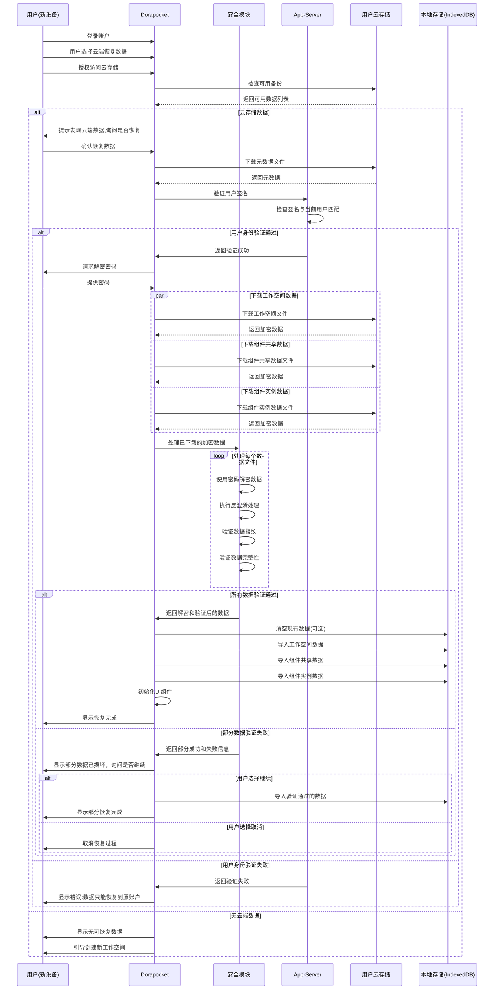

```mermaid
sequenceDiagram
    participant User as 用户(新设备)
    participant App as Dorapocket
    participant Security as 安全模块
    participant AppServer as App-Server
    participant UserCloud as 用户云存储
    participant LocalDB as 本地存储(IndexedDB)
    
    User->>App: 登录账户
    User->>App: 用户选择云端恢复数据
    User->>App: 授权访问云存储
    
    App->>UserCloud: 检查可用备份
    UserCloud-->>App: 返回可用数据列表
    
    alt 云存储数据
        App->>User: 提示发现云端数据,询问是否恢复
        User->>App: 确认恢复数据
        
        App->>UserCloud: 下载元数据文件
        UserCloud-->>App: 返回元数据
        
        App->>AppServer: 验证用户签名
        AppServer->>AppServer: 检查签名与当前用户匹配
        
        alt 用户身份验证通过
            AppServer->>App: 返回验证成功
            
            App->>User: 请求解密密码
            User->>App: 提供密码
            
            par 下载工作空间数据
                App->>UserCloud: 下载工作空间文件
                UserCloud-->>App: 返回加密数据
            and 下载组件共享数据
                App->>UserCloud: 下载组件共享数据文件
                UserCloud-->>App: 返回加密数据
            and 下载组件实例数据
                App->>UserCloud: 下载组件实例数据文件
                UserCloud-->>App: 返回加密数据
            end
            
            App->>Security: 处理已下载的加密数据
            loop 处理每个数据文件
                Security->>Security: 使用密码解密数据
                Security->>Security: 执行反混淆处理
                Security->>Security: 验证数据指纹
                Security->>Security: 验证数据完整性
            end
            
            alt 所有数据验证通过
                Security->>App: 返回解密和验证后的数据
                
                App->>LocalDB: 清空现有数据(可选)
                App->>LocalDB: 导入工作空间数据
                App->>LocalDB: 导入组件共享数据
                App->>LocalDB: 导入组件实例数据
                
                App->>App: 初始化UI组件
                App->>User: 显示恢复完成
            else 部分数据验证失败
                Security->>App: 返回部分成功和失败信息
                App->>User: 显示部分数据已损坏，询问是否继续
                
                alt 用户选择继续
                    App->>LocalDB: 导入验证通过的数据
                    App->>User: 显示部分恢复完成
                else 用户选择取消
                    App->>User: 取消恢复过程
                end
            end
        else 用户身份验证失败
            AppServer->>App: 返回验证失败
            App->>User: 显示错误:数据只能恢复到原账户
        end
    else 无云端数据
        App->>User: 显示无可恢复数据
        App->>User: 引导创建新工作空间
    end
```