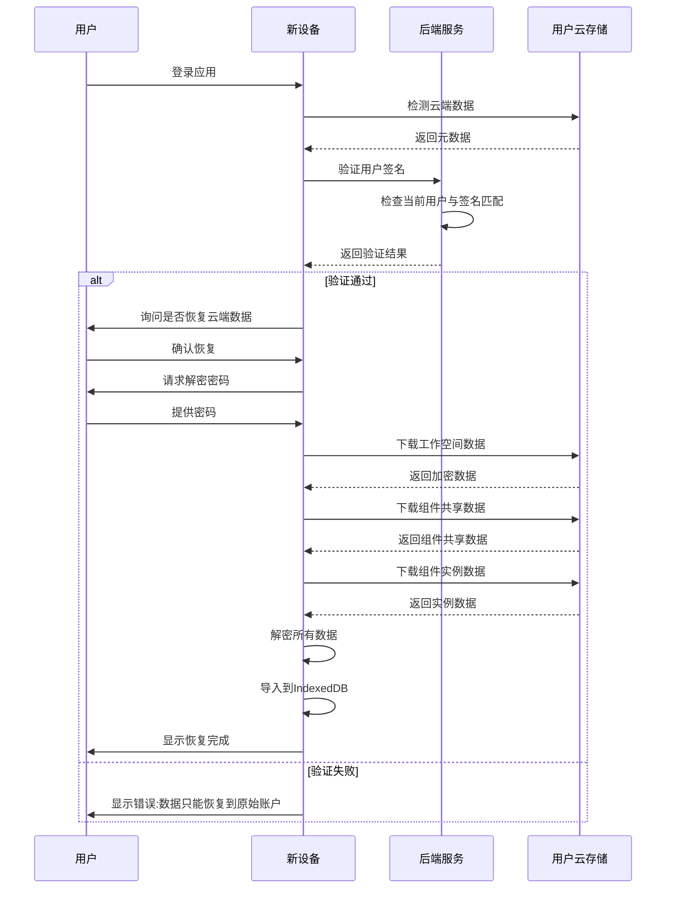

```mermaid
sequenceDiagram
    participant User as 用户
    participant NewDevice as 新设备
    participant Server as 后端服务
    participant Cloud as 用户云存储
    
    User->>NewDevice: 登录应用
    NewDevice->>Cloud: 检测云端数据
    Cloud-->>NewDevice: 返回元数据
    
    NewDevice->>Server: 验证用户签名
    Server->>Server: 检查当前用户与签名匹配
    Server-->>NewDevice: 返回验证结果
    
    alt 验证通过
        NewDevice->>User: 询问是否恢复云端数据
        User->>NewDevice: 确认恢复
        
        NewDevice->>User: 请求解密密码
        User->>NewDevice: 提供密码
        
        NewDevice->>Cloud: 下载工作空间数据
        Cloud-->>NewDevice: 返回加密数据
        
        NewDevice->>Cloud: 下载组件共享数据
        Cloud-->>NewDevice: 返回组件共享数据
        
        NewDevice->>Cloud: 下载组件实例数据
        Cloud-->>NewDevice: 返回实例数据
        
        NewDevice->>NewDevice: 解密所有数据
        NewDevice->>NewDevice: 导入到IndexedDB
        NewDevice->>User: 显示恢复完成
    else 验证失败
        NewDevice->>User: 显示错误:数据只能恢复到原始账户
    end
```