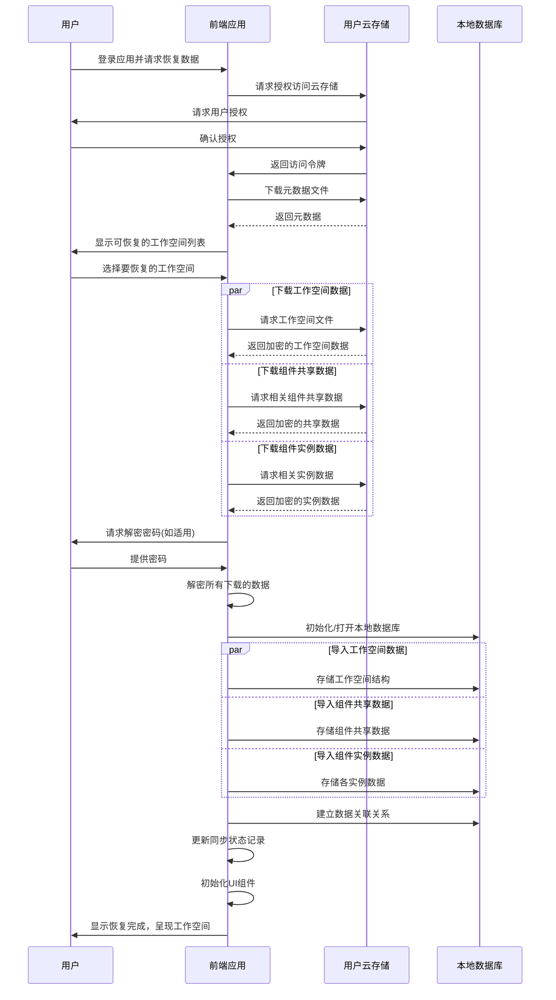

```mermaid
sequenceDiagram
    participant User as 用户
    participant App as 前端应用
    participant Cloud as 用户云存储
    participant IndexedDB as 本地数据库
    
    User->>App: 登录应用并请求恢复数据
    App->>Cloud: 请求授权访问云存储
    Cloud->>User: 请求用户授权
    User->>Cloud: 确认授权
    Cloud->>App: 返回访问令牌
    
    App->>Cloud: 下载元数据文件
    Cloud-->>App: 返回元数据
    
    App->>User: 显示可恢复的工作空间列表
    User->>App: 选择要恢复的工作空间
    
    par 下载工作空间数据
        App->>Cloud: 请求工作空间文件
        Cloud-->>App: 返回加密的工作空间数据
    and 下载组件共享数据
        App->>Cloud: 请求相关组件共享数据
        Cloud-->>App: 返回加密的共享数据
    and 下载组件实例数据
        App->>Cloud: 请求相关实例数据
        Cloud-->>App: 返回加密的实例数据
    end
    
    App->>User: 请求解密密码(如适用)
    User->>App: 提供密码
    
    App->>App: 解密所有下载的数据
    
    App->>IndexedDB: 初始化/打开本地数据库
    
    par 导入工作空间数据
        App->>IndexedDB: 存储工作空间结构
    and 导入组件共享数据
        App->>IndexedDB: 存储组件共享数据
    and 导入组件实例数据 
        App->>IndexedDB: 存储各实例数据
    end
    
    App->>IndexedDB: 建立数据关联关系
    App->>App: 更新同步状态记录
    
    App->>App: 初始化UI组件
    App->>User: 显示恢复完成，呈现工作空间
```