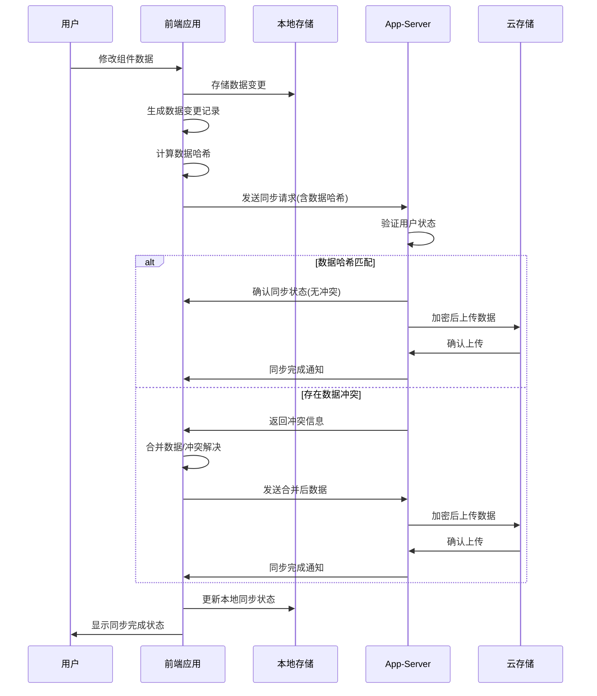

```mermaid
sequenceDiagram
    participant User as 用户
    participant Frontend as 前端应用
    participant LocalDB as 本地存储
    participant AppServer as App-Server
    participant CloudStorage as 云存储
    
    User->>Frontend: 修改组件数据
    Frontend->>LocalDB: 存储数据变更
    Frontend->>Frontend: 生成数据变更记录
    Frontend->>Frontend: 计算数据哈希
    Frontend->>AppServer: 发送同步请求(含数据哈希)
    AppServer->>AppServer: 验证用户状态
    
    alt 数据哈希匹配
        AppServer->>Frontend: 确认同步状态(无冲突)
        AppServer->>CloudStorage: 加密后上传数据
        CloudStorage->>AppServer: 确认上传
        AppServer->>Frontend: 同步完成通知
    else 存在数据冲突
        AppServer->>Frontend: 返回冲突信息
        Frontend->>Frontend: 合并数据/冲突解决
        Frontend->>AppServer: 发送合并后数据
        AppServer->>CloudStorage: 加密后上传数据
        CloudStorage->>AppServer: 确认上传
        AppServer->>Frontend: 同步完成通知
    end
    
    Frontend->>LocalDB: 更新本地同步状态
    Frontend->>User: 显示同步完成状态
```