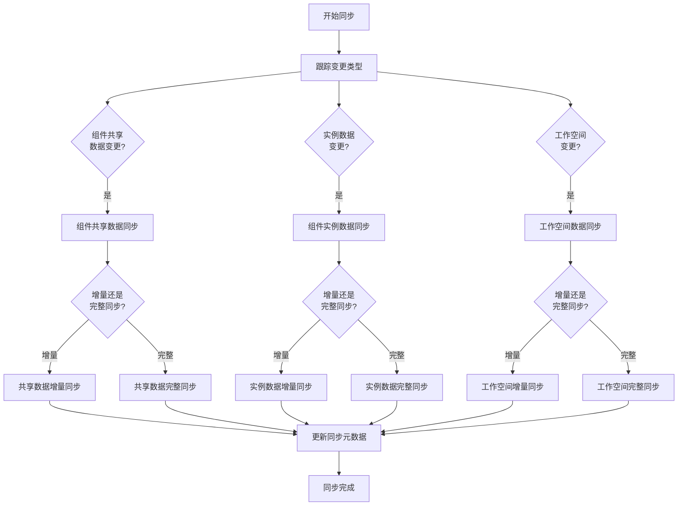

```mermaid
flowchart TD
    Start[开始同步] --> TrackChanges[跟踪变更类型]
    
    TrackChanges --> SharedChanges{组件共享<br>数据变更?}
    TrackChanges --> InstanceChanges{实例数据<br>变更?}
    TrackChanges --> WorkspaceChanges{工作空间<br>变更?}
    
    SharedChanges -->|是| SyncShared[组件共享数据同步]
    InstanceChanges -->|是| SyncInstance[组件实例数据同步]
    WorkspaceChanges -->|是| SyncWorkspace[工作空间数据同步]
    
    SyncShared --> DetermineStrategy1{增量还是<br>完整同步?}
    SyncInstance --> DetermineStrategy2{增量还是<br>完整同步?}
    SyncWorkspace --> DetermineStrategy3{增量还是<br>完整同步?}
    
    DetermineStrategy1 -->|增量| IncrementalShared[共享数据增量同步]
    DetermineStrategy1 -->|完整| FullShared[共享数据完整同步]
    
    DetermineStrategy2 -->|增量| IncrementalInstance[实例数据增量同步]
    DetermineStrategy2 -->|完整| FullInstance[实例数据完整同步]
    
    DetermineStrategy3 -->|增量| IncrementalWorkspace[工作空间增量同步]
    DetermineStrategy3 -->|完整| FullWorkspace[工作空间完整同步]
    
    IncrementalShared & FullShared & IncrementalInstance & FullInstance & IncrementalWorkspace & FullWorkspace --> UpdateMetadata[更新同步元数据]
    
    UpdateMetadata --> End[同步完成]
```