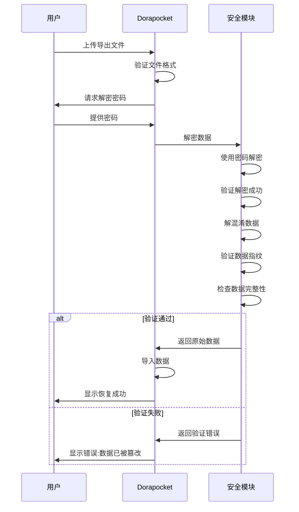

```mermaid
sequenceDiagram
    participant User as 用户
    participant App as Dorapocket
    participant Security as 安全模块
    
    User->>App: 上传导出文件
    App->>App: 验证文件格式
    App->>User: 请求解密密码
    User->>App: 提供密码
    
    App->>Security: 解密数据
    Security->>Security: 使用密码解密
    Security->>Security: 验证解密成功
    
    Security->>Security: 解混淆数据
    Security->>Security: 验证数据指纹
    Security->>Security: 检查数据完整性
    
    alt 验证通过
        Security->>App: 返回原始数据
        App->>App: 导入数据
        App->>User: 显示恢复成功
    else 验证失败
        Security->>App: 返回验证错误
        App->>User: 显示错误:数据已被篡改
    end
```