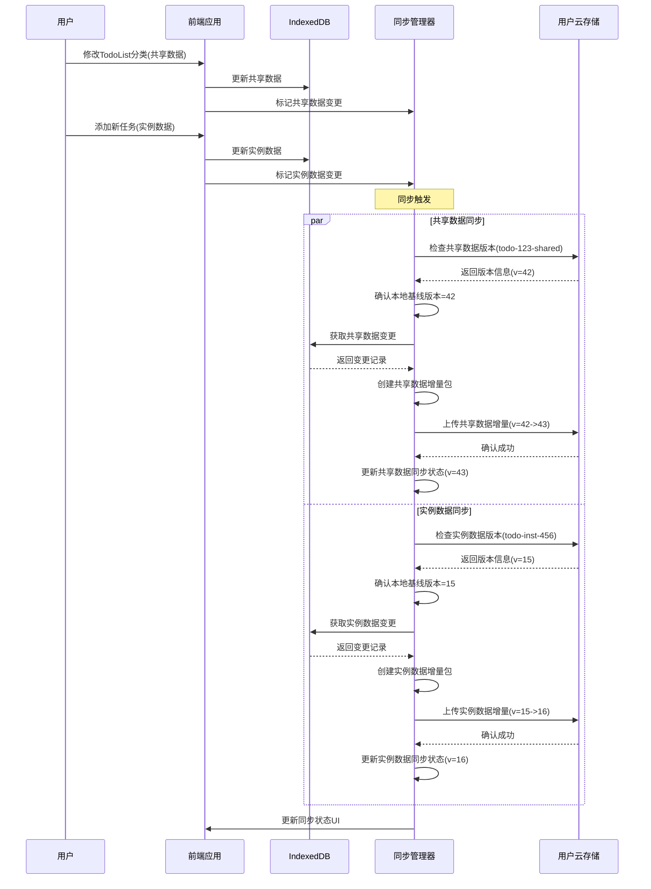

```mermaid
sequenceDiagram
    participant User as 用户
    participant Frontend as 前端应用
    participant LocalDB as IndexedDB
    participant SyncManager as 同步管理器
    participant Cloud as 用户云存储
    
    User->>Frontend: 修改TodoList分类(共享数据)
    Frontend->>LocalDB: 更新共享数据
    Frontend->>SyncManager: 标记共享数据变更
    
    User->>Frontend: 添加新任务(实例数据)
    Frontend->>LocalDB: 更新实例数据
    Frontend->>SyncManager: 标记实例数据变更
    
    note over SyncManager: 同步触发
    
    par 共享数据同步
        SyncManager->>Cloud: 检查共享数据版本(todo-123-shared)
        Cloud-->>SyncManager: 返回版本信息(v=42)
        
        SyncManager->>SyncManager: 确认本地基线版本=42
        SyncManager->>LocalDB: 获取共享数据变更
        LocalDB-->>SyncManager: 返回变更记录
        
        SyncManager->>SyncManager: 创建共享数据增量包
        SyncManager->>Cloud: 上传共享数据增量(v=42->43)
        Cloud-->>SyncManager: 确认成功
        
        SyncManager->>SyncManager: 更新共享数据同步状态(v=43)
    and 实例数据同步
        SyncManager->>Cloud: 检查实例数据版本(todo-inst-456)
        Cloud-->>SyncManager: 返回版本信息(v=15)
        
        SyncManager->>SyncManager: 确认本地基线版本=15
        SyncManager->>LocalDB: 获取实例数据变更
        LocalDB-->>SyncManager: 返回变更记录
        
        SyncManager->>SyncManager: 创建实例数据增量包
        SyncManager->>Cloud: 上传实例数据增量(v=15->16)
        Cloud-->>SyncManager: 确认成功
        
        SyncManager->>SyncManager: 更新实例数据同步状态(v=16)
    end
    
    SyncManager->>Frontend: 更新同步状态UI
```