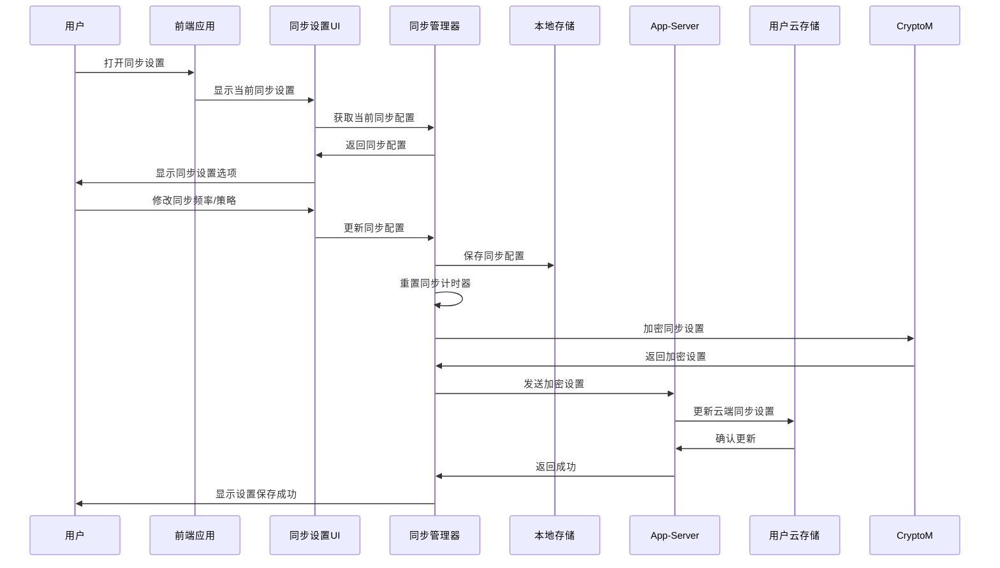

```mermaid
sequenceDiagram
    participant User as 用户
    participant Frontend as 前端应用
    participant SyncSettings as 同步设置UI
    participant SyncM as 同步管理器
    participant LocalDB as 本地存储
    participant AppServer as App-Server
    participant UserCloud as 用户云存储
    
    User->>Frontend: 打开同步设置
    Frontend->>SyncSettings: 显示当前同步设置
    SyncSettings->>SyncM: 获取当前同步配置
    SyncM->>SyncSettings: 返回同步配置
    SyncSettings->>User: 显示同步设置选项
    
    User->>SyncSettings: 修改同步频率/策略
    SyncSettings->>SyncM: 更新同步配置
    SyncM->>LocalDB: 保存同步配置
    SyncM->>SyncM: 重置同步计时器
    
    SyncM->>CryptoM: 加密同步设置
    CryptoM->>SyncM: 返回加密设置
    SyncM->>AppServer: 发送加密设置
    AppServer->>UserCloud: 更新云端同步设置
    UserCloud->>AppServer: 确认更新
    AppServer->>SyncM: 返回成功
    SyncM->>User: 显示设置保存成功
```