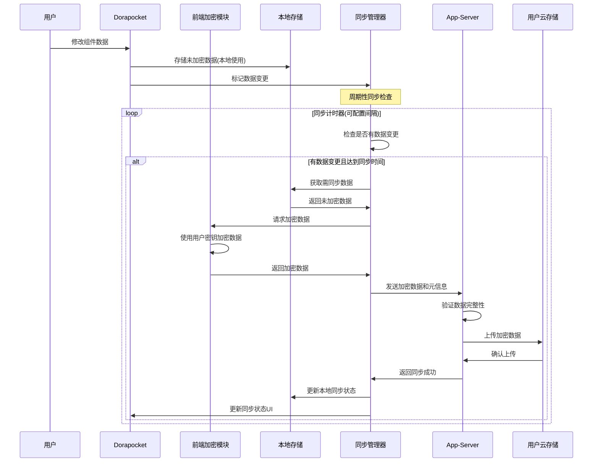

```mermaid
sequenceDiagram
    participant User as 用户
    participant Frontend as Dorapocket
    participant CryptoM as 前端加密模块
    participant LocalDB as 本地存储
    participant SyncM as 同步管理器
    participant AppServer as App-Server
    participant UserCloud as 用户云存储
    
    User->>Frontend: 修改组件数据
    Frontend->>LocalDB: 存储未加密数据(本地使用)
    Frontend->>SyncM: 标记数据变更
    
    note over SyncM: 周期性同步检查
    
    loop 同步计时器(可配置间隔)
        SyncM->>SyncM: 检查是否有数据变更
        
        alt 有数据变更且达到同步时间
            SyncM->>LocalDB: 获取需同步数据
            LocalDB->>SyncM: 返回未加密数据
            SyncM->>CryptoM: 请求加密数据
            CryptoM->>CryptoM: 使用用户密钥加密数据
            CryptoM->>SyncM: 返回加密数据
            SyncM->>AppServer: 发送加密数据和元信息
            AppServer->>AppServer: 验证数据完整性
            AppServer->>UserCloud: 上传加密数据
            UserCloud->>AppServer: 确认上传
            AppServer->>SyncM: 返回同步成功
            SyncM->>LocalDB: 更新本地同步状态
            SyncM->>Frontend: 更新同步状态UI
        end
    end
```