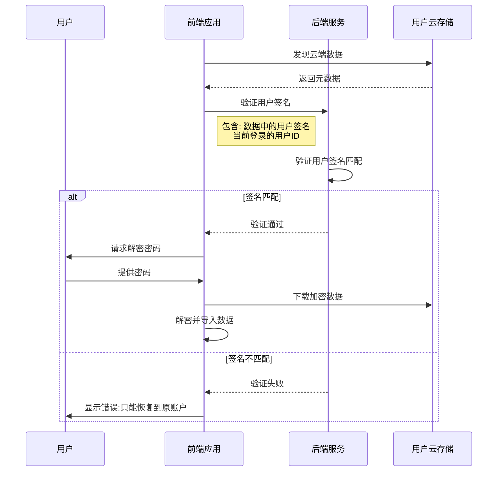

```mermaid
sequenceDiagram
    participant User as 用户
    participant FrontEnd as 前端应用
    participant Server as 后端服务
    participant Cloud as 用户云存储
    
    FrontEnd->>Cloud: 发现云端数据
    Cloud-->>FrontEnd: 返回元数据
    
    FrontEnd->>Server: 验证用户签名
    note right of FrontEnd: 包含: 数据中的用户签名<br>当前登录的用户ID
    
    Server->>Server: 验证用户签名匹配
    
    alt 签名匹配
        Server-->>FrontEnd: 验证通过
        FrontEnd->>User: 请求解密密码
        User->>FrontEnd: 提供密码
        FrontEnd->>Cloud: 下载加密数据
        FrontEnd->>FrontEnd: 解密并导入数据
    else 签名不匹配
        Server-->>FrontEnd: 验证失败
        FrontEnd->>User: 显示错误:只能恢复到原账户
    end
```