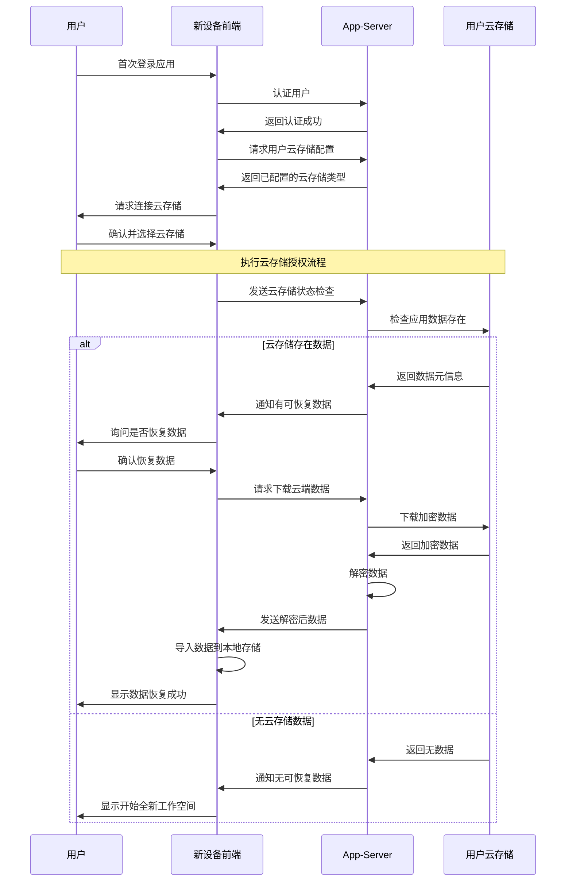

```mermaid
sequenceDiagram
    participant User as 用户
    participant NewDevice as 新设备前端
    participant AppServer as App-Server
    participant UserCloud as 用户云存储
    
    User->>NewDevice: 首次登录应用
    NewDevice->>AppServer: 认证用户
    AppServer->>NewDevice: 返回认证成功
    
    NewDevice->>AppServer: 请求用户云存储配置
    AppServer->>NewDevice: 返回已配置的云存储类型
    
    NewDevice->>User: 请求连接云存储
    User->>NewDevice: 确认并选择云存储
    
    note over User,UserCloud: 执行云存储授权流程
    
    NewDevice->>AppServer: 发送云存储状态检查
    AppServer->>UserCloud: 检查应用数据存在
    
    alt 云存储存在数据
        UserCloud->>AppServer: 返回数据元信息
        AppServer->>NewDevice: 通知有可恢复数据
        NewDevice->>User: 询问是否恢复数据
        User->>NewDevice: 确认恢复数据
        NewDevice->>AppServer: 请求下载云端数据
        AppServer->>UserCloud: 下载加密数据
        UserCloud->>AppServer: 返回加密数据
        AppServer->>AppServer: 解密数据
        AppServer->>NewDevice: 发送解密后数据
        NewDevice->>NewDevice: 导入数据到本地存储
        NewDevice->>User: 显示数据恢复成功
    else 无云存储数据
        UserCloud->>AppServer: 返回无数据
        AppServer->>NewDevice: 通知无可恢复数据
        NewDevice->>User: 显示开始全新工作空间
    end
```