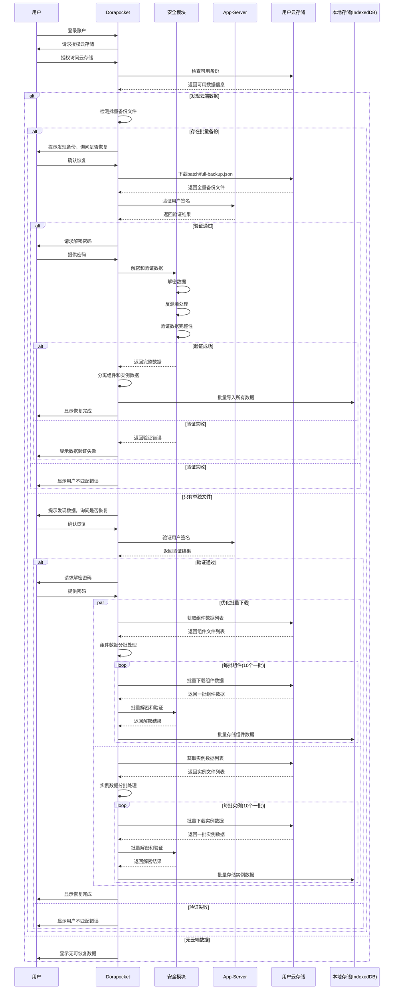

```mermaid
sequenceDiagram
    participant User as 用户
    participant App as Dorapocket
    participant Security as 安全模块
    participant AppServer as App-Server
    participant UserCloud as 用户云存储
    participant LocalDB as 本地存储(IndexedDB)
    
    User->>App: 登录账户
    App->>User: 请求授权云存储
    User->>App: 授权访问云存储
    
    App->>UserCloud: 检查可用备份
    UserCloud-->>App: 返回可用数据信息
    
    alt 发现云端数据
        App->>App: 检测批量备份文件
        
        alt 存在批量备份
            App->>User: 提示发现备份，询问是否恢复
            User->>App: 确认恢复
            
            App->>UserCloud: 下载batch/full-backup.json
            UserCloud-->>App: 返回全量备份文件
            
            App->>AppServer: 验证用户签名
            AppServer-->>App: 返回验证结果
            
            alt 验证通过
                App->>User: 请求解密密码
                User->>App: 提供密码
                
                App->>Security: 解密和验证数据
                Security->>Security: 解密数据
                Security->>Security: 反混淆处理
                Security->>Security: 验证数据完整性
                
                alt 验证成功
                    Security-->>App: 返回完整数据
                    App->>App: 分离组件和实例数据
                    App->>LocalDB: 批量导入所有数据
                    App->>User: 显示恢复完成
                else 验证失败
                    Security-->>App: 返回验证错误
                    App->>User: 显示数据验证失败
                end
            else 验证失败
                App->>User: 显示用户不匹配错误
            end
        else 只有单独文件
            App->>User: 提示发现数据，询问是否恢复
            User->>App: 确认恢复
            
            App->>AppServer: 验证用户签名
            AppServer-->>App: 返回验证结果
            
            alt 验证通过
                App->>User: 请求解密密码
                User->>App: 提供密码
                
                par 优化批量下载
                    App->>UserCloud: 获取组件数据列表
                    UserCloud-->>App: 返回组件文件列表
                    App->>App: 组件数据分批处理
                    
                    loop 每批组件(10个一批)
                        App->>UserCloud: 批量下载组件数据
                        UserCloud-->>App: 返回一批组件数据
                        App->>Security: 批量解密和验证
                        Security-->>App: 返回解密结果
                        App->>LocalDB: 批量存储组件数据
                    end
                and
                    App->>UserCloud: 获取实例数据列表
                    UserCloud-->>App: 返回实例文件列表
                    App->>App: 实例数据分批处理
                    
                    loop 每批实例(10个一批)
                        App->>UserCloud: 批量下载实例数据
                        UserCloud-->>App: 返回一批实例数据
                        App->>Security: 批量解密和验证
                        Security-->>App: 返回解密结果
                        App->>LocalDB: 批量存储实例数据
                    end
                end
                
                App->>User: 显示恢复完成
            else 验证失败
                App->>User: 显示用户不匹配错误
            end
        end
    else 无云端数据
        App->>User: 显示无可恢复数据
    end
```