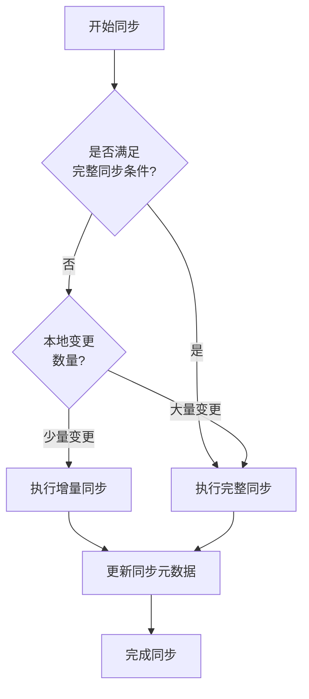

```mermaid
flowchart TD
    Start[开始同步] --> Check{是否满足<br>完整同步条件?}
    Check -->|是| FullSync[执行完整同步]
    Check -->|否| Changes{本地变更<br>数量?}
    
    Changes -->|少量变更| IncrementalSync[执行增量同步]
    Changes -->|大量变更| FullSync
    
    IncrementalSync --> UpdateMeta[更新同步元数据]
    FullSync --> UpdateMeta
    
    UpdateMeta --> End[完成同步]
```