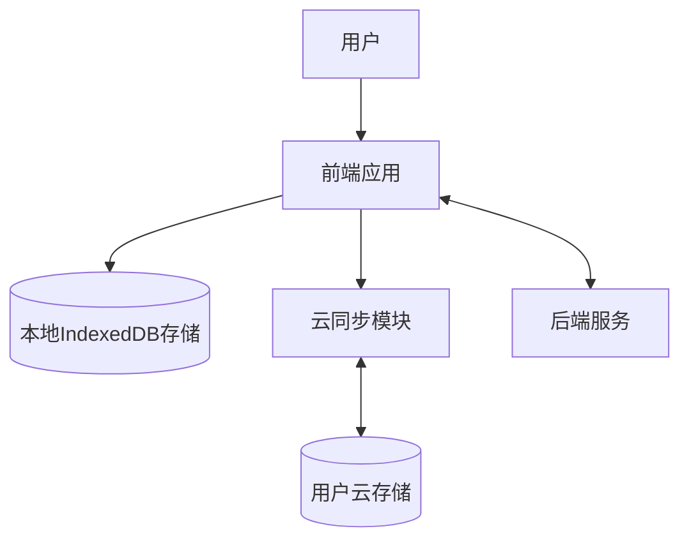

```mermaid
flowchart TD
    User[用户] --> FrontEnd[前端应用]
    FrontEnd --> LocalStorage[(本地IndexedDB存储)]
    FrontEnd --> CloudSync[云同步模块]
    CloudSync <--> CloudStorage[(用户云存储)]
    FrontEnd <--> Server[后端服务]
```