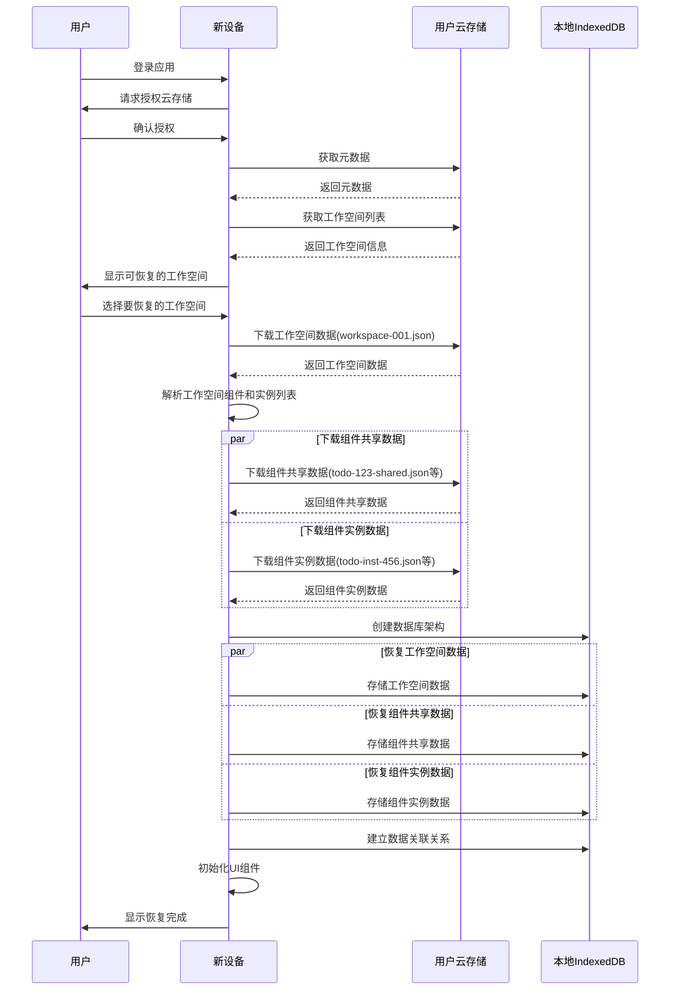

```mermaid
sequenceDiagram
    participant User as 用户
    participant NewDevice as 新设备
    participant Cloud as 用户云存储
    participant IndexedDB as 本地IndexedDB
    
    User->>NewDevice: 登录应用
    NewDevice->>User: 请求授权云存储
    User->>NewDevice: 确认授权
    
    NewDevice->>Cloud: 获取元数据
    Cloud-->>NewDevice: 返回元数据
    
    NewDevice->>Cloud: 获取工作空间列表
    Cloud-->>NewDevice: 返回工作空间信息
    
    NewDevice->>User: 显示可恢复的工作空间
    User->>NewDevice: 选择要恢复的工作空间
    
    NewDevice->>Cloud: 下载工作空间数据(workspace-001.json)
    Cloud-->>NewDevice: 返回工作空间数据
    
    NewDevice->>NewDevice: 解析工作空间组件和实例列表
    
    par 下载组件共享数据
        NewDevice->>Cloud: 下载组件共享数据(todo-123-shared.json等)
        Cloud-->>NewDevice: 返回组件共享数据
    and 下载组件实例数据
        NewDevice->>Cloud: 下载组件实例数据(todo-inst-456.json等)
        Cloud-->>NewDevice: 返回组件实例数据
    end
    
    NewDevice->>IndexedDB: 创建数据库架构
    
    par 恢复工作空间数据
        NewDevice->>IndexedDB: 存储工作空间数据
    and 恢复组件共享数据
        NewDevice->>IndexedDB: 存储组件共享数据
    and 恢复组件实例数据
        NewDevice->>IndexedDB: 存储组件实例数据
    end
    
    NewDevice->>IndexedDB: 建立数据关联关系
    NewDevice->>NewDevice: 初始化UI组件
    NewDevice->>User: 显示恢复完成
```