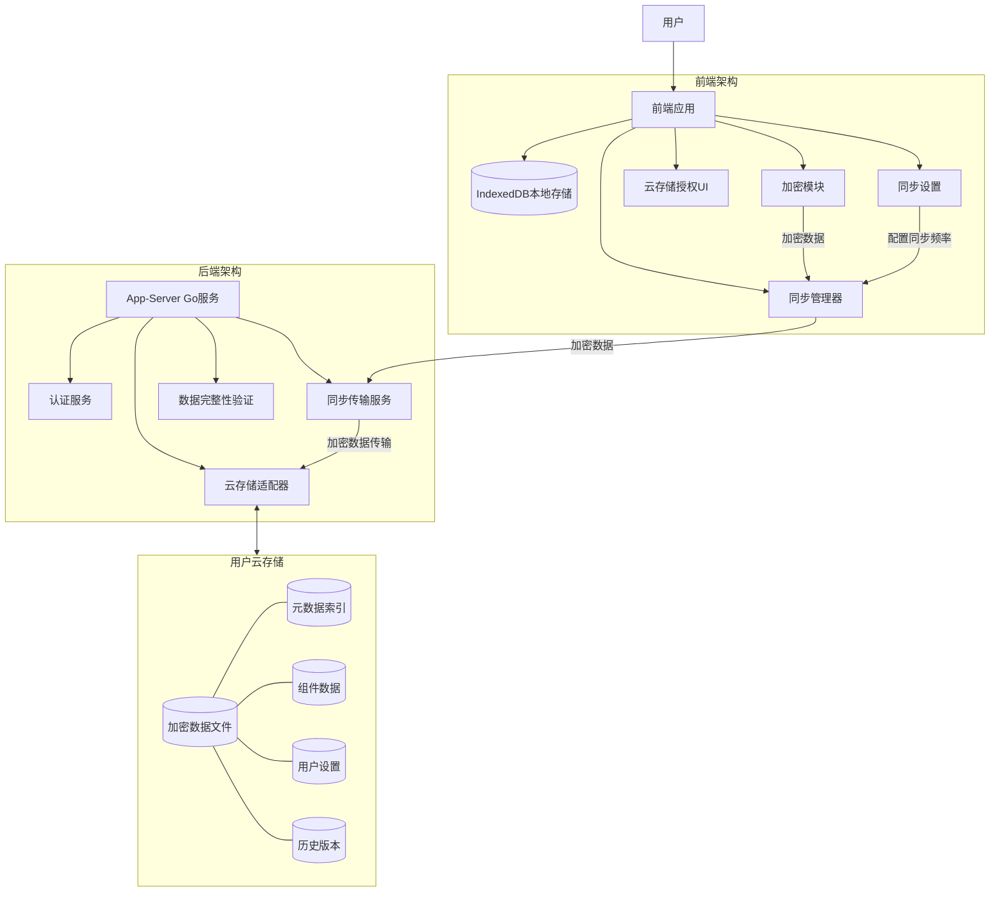

```mermaid
flowchart TD
    User[用户] --> FrontEnd[前端应用]
    
    subgraph 前端架构
        FrontEnd --> LocalDB[(IndexedDB本地存储)]
        FrontEnd --> CryptoModule[加密模块]
        FrontEnd --> SyncManager[同步管理器]
        FrontEnd --> CloudAuthUI[云存储授权UI]
        FrontEnd --> SyncSettings[同步设置]
    end
    
    subgraph 后端架构
        AppServer[App-Server Go服务] --> AuthService[认证服务]
        AppServer --> SyncService[同步传输服务]
        AppServer --> CloudAdapter[云存储适配器]
        AppServer --> IntegrityValidator[数据完整性验证]
    end
    
    subgraph 用户云存储
        CloudData[(加密数据文件)] --- MetaIndex[(元数据索引)]
        CloudData --- ComponentData[(组件数据)]
        CloudData --- UserSettings[(用户设置)]
        CloudData --- VersionBackups[(历史版本)]
    end
    
    CryptoModule -- "加密数据" --> SyncManager
    SyncManager -- "加密数据" --> SyncService
    SyncService -- "加密数据传输" --> CloudAdapter
    CloudAdapter <--> 用户云存储
    SyncSettings -- "配置同步频率" --> SyncManager
```