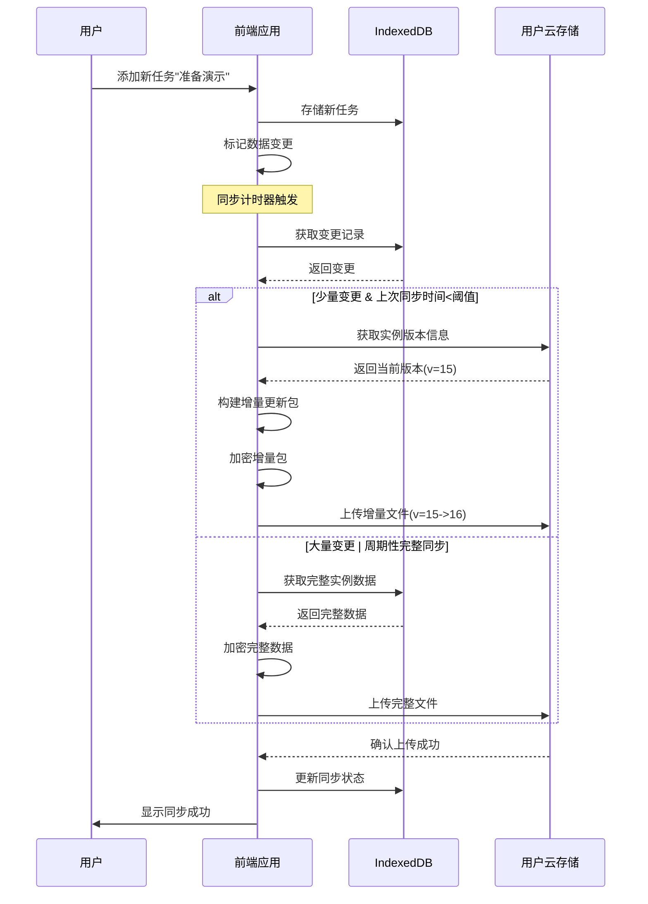

```mermaid
sequenceDiagram
    participant User as 用户
    participant FrontEnd as 前端应用
    participant LocalDB as IndexedDB
    participant Cloud as 用户云存储
    
    User->>FrontEnd: 添加新任务"准备演示"
    FrontEnd->>LocalDB: 存储新任务
    FrontEnd->>FrontEnd: 标记数据变更
    
    note over FrontEnd: 同步计时器触发
    
    FrontEnd->>LocalDB: 获取变更记录
    LocalDB-->>FrontEnd: 返回变更
    
    alt 少量变更 & 上次同步时间<阈值
        FrontEnd->>Cloud: 获取实例版本信息
        Cloud-->>FrontEnd: 返回当前版本(v=15)
        FrontEnd->>FrontEnd: 构建增量更新包
        FrontEnd->>FrontEnd: 加密增量包
        FrontEnd->>Cloud: 上传增量文件(v=15->16)
    else 大量变更 | 周期性完整同步
        FrontEnd->>LocalDB: 获取完整实例数据
        LocalDB-->>FrontEnd: 返回完整数据
        FrontEnd->>FrontEnd: 加密完整数据
        FrontEnd->>Cloud: 上传完整文件
    end
    
    Cloud-->>FrontEnd: 确认上传成功
    FrontEnd->>LocalDB: 更新同步状态
    FrontEnd->>User: 显示同步成功
```