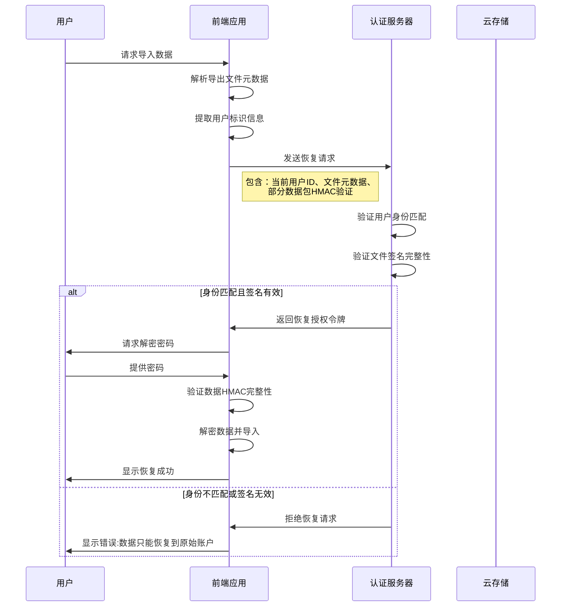

```mermaid
sequenceDiagram
    participant User as 用户
    participant App as 前端应用
    participant Server as 认证服务器
    participant Cloud as 云存储
    
    User->>App: 请求导入数据
    App->>App: 解析导出文件元数据
    App->>App: 提取用户标识信息
    
    App->>Server: 发送恢复请求
    note right of App: 包含：当前用户ID、文件元数据、<br/>部分数据包HMAC验证
    
    Server->>Server: 验证用户身份匹配
    Server->>Server: 验证文件签名完整性
    
    alt 身份匹配且签名有效
        Server->>App: 返回恢复授权令牌
        App->>User: 请求解密密码
        User->>App: 提供密码
        App->>App: 验证数据HMAC完整性
        App->>App: 解密数据并导入
        App->>User: 显示恢复成功
    else 身份不匹配或签名无效
        Server->>App: 拒绝恢复请求
        App->>User: 显示错误:数据只能恢复到原始账户
    end
```