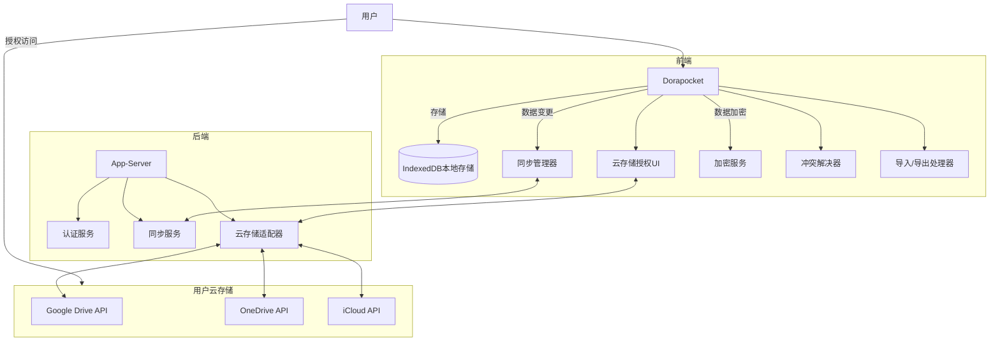

```mermaid
flowchart TD
    User[用户] --> FrontEnd[Dorapocket]
    
    subgraph 前端
        FrontEnd --> |存储| LocalDB[(IndexedDB本地存储)]
        FrontEnd --> |数据变更| SyncManager[同步管理器]
        FrontEnd --> CloudAuthUI[云存储授权UI]
        FrontEnd --> |数据加密|CryptoService[加密服务]
        FrontEnd --> ConflictResolver[冲突解决器]
        FrontEnd --> J[导入/导出处理器]
    end
    
    subgraph 后端
        AppServer[App-Server] --> AuthService[认证服务]
        AppServer --> SyncService[同步服务]
        AppServer --> CloudAdapter[云存储适配器]
    end
    
    subgraph 用户云存储
        CloudAdapter <--> GoogleDrive[Google Drive API]
        CloudAdapter <--> OneDrive[OneDrive API]
        CloudAdapter <--> iCloud[iCloud API]
    end
    
    User -- "授权访问" --> 用户云存储
    SyncManager <--> SyncService
    CloudAuthUI <--> CloudAdapter
```