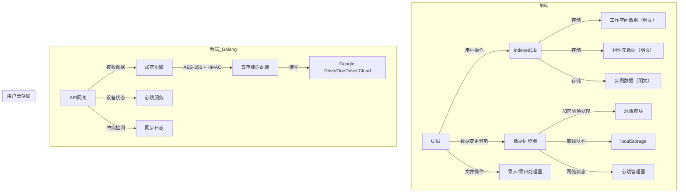

```mermaid
flowchart TD
    subgraph 前端
        A[UI层] -->|用户操作| B(IndexedDB)
        B -->|存储| C["工作空间数据（明文）"]
        B -->|存储| D["组件元数据（明文）"]
        B -->|存储| E["实例数据（明文）"]
        A -->|数据变更监听| F[数据同步器]
        F -->|加密前预处理| G[混淆模块]
        F -->|离线队列| H[localStorage]
        F -->|网络状态| I[心跳管理器]
        A -->|文件操作| J[导入/导出处理器]
    end

    subgraph 后端_Golang
        K[API网关] -->|接收数据| L[加密引擎]
        L -->|AES-256 + HMAC| M[云存储适配器]
        M -->|读写| N[用户云存储]
        K -->|设备状态| O[心跳服务]
        K -->|冲突检测| P[同步日志]
    end

    subgraph 用户云存储
        N[Google Drive/OneDrive/iCloud]
    end
```