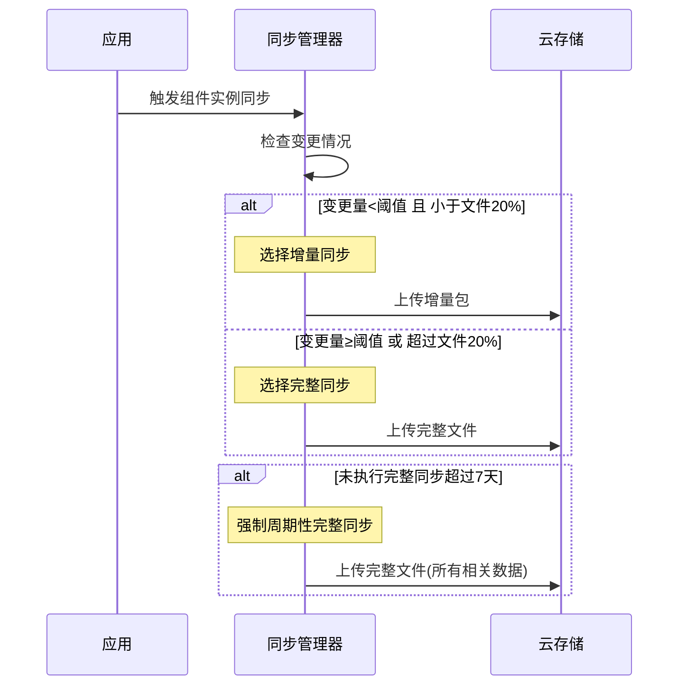

```mermaid
sequenceDiagram
    participant App as 应用
    participant SyncManager as 同步管理器
    participant Cloud as 云存储
    
    App->>SyncManager: 触发组件实例同步
    
    SyncManager->>SyncManager: 检查变更情况
    
    alt 变更量<阈值 且 小于文件20%
        note over SyncManager: 选择增量同步
        SyncManager->>Cloud: 上传增量包
    else 变更量≥阈值 或 超过文件20%
        note over SyncManager: 选择完整同步
        SyncManager->>Cloud: 上传完整文件
    end
    
    alt 未执行完整同步超过7天
        note over SyncManager: 强制周期性完整同步
        SyncManager->>Cloud: 上传完整文件(所有相关数据)
    end
```