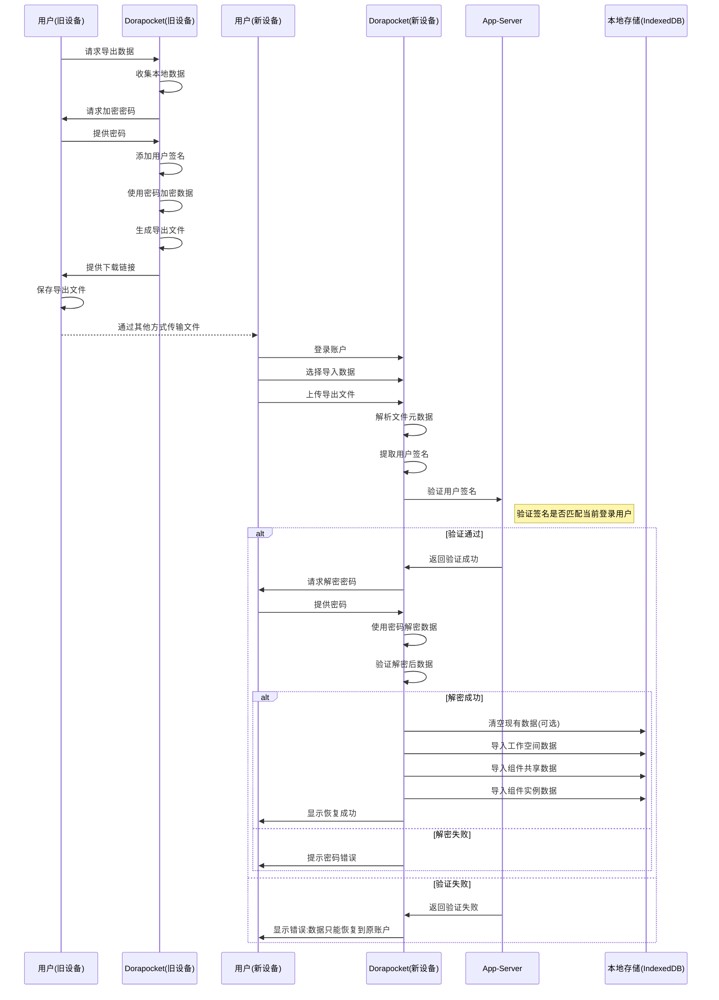

```mermaid
sequenceDiagram
    participant UserOld as 用户(旧设备)
    participant AppOld as Dorapocket(旧设备)
    participant UserNew as 用户(新设备)
    participant AppNew as Dorapocket(新设备)
    participant AppServer as App-Server
    participant LocalDB as 本地存储(IndexedDB)
    
    %% 导出流程
    UserOld->>AppOld: 请求导出数据
    AppOld->>AppOld: 收集本地数据
    AppOld->>UserOld: 请求加密密码
    UserOld->>AppOld: 提供密码
    
    AppOld->>AppOld: 添加用户签名
    AppOld->>AppOld: 使用密码加密数据
    AppOld->>AppOld: 生成导出文件
    AppOld->>UserOld: 提供下载链接
    UserOld->>UserOld: 保存导出文件
    
    %% 传输文件(由用户完成)
    UserOld-->>UserNew: 通过其他方式传输文件
    
    %% 恢复流程
    UserNew->>AppNew: 登录账户
    UserNew->>AppNew: 选择导入数据
    UserNew->>AppNew: 上传导出文件
    
    AppNew->>AppNew: 解析文件元数据
    AppNew->>AppNew: 提取用户签名
    
    AppNew->>AppServer: 验证用户签名
    note right of AppServer: 验证签名是否匹配当前登录用户
    
    alt 验证通过
        AppServer->>AppNew: 返回验证成功
        AppNew->>UserNew: 请求解密密码
        UserNew->>AppNew: 提供密码
        
        AppNew->>AppNew: 使用密码解密数据
        AppNew->>AppNew: 验证解密后数据
        
        alt 解密成功
            AppNew->>LocalDB: 清空现有数据(可选)
            AppNew->>LocalDB: 导入工作空间数据
            AppNew->>LocalDB: 导入组件共享数据
            AppNew->>LocalDB: 导入组件实例数据
            AppNew->>UserNew: 显示恢复成功
        else 解密失败
            AppNew->>UserNew: 提示密码错误
        end
    else 验证失败
        AppServer->>AppNew: 返回验证失败
        AppNew->>UserNew: 显示错误:数据只能恢复到原账户
    end
```