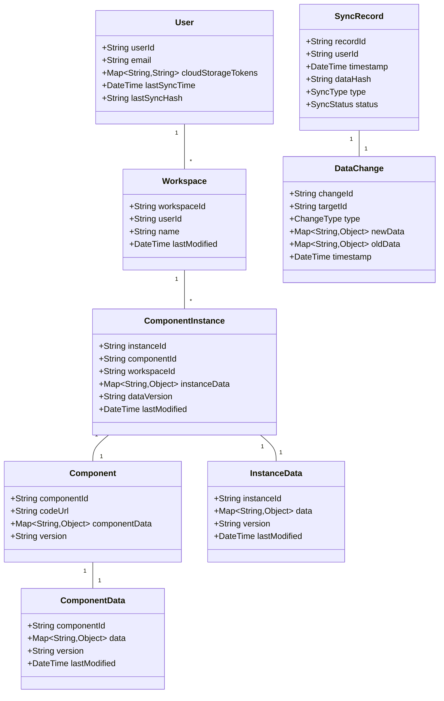

```mermaid
classDiagram
    User "1" -- "*" Workspace
    Workspace "1" -- "*" ComponentInstance
    ComponentInstance "1" -- "1" Component
    ComponentInstance "1" -- "1" InstanceData
    Component "1" -- "1" ComponentData
    SyncRecord "1" -- "1" DataChange
    
    class User {
        +String userId
        +String email
        +Map~String,String~ cloudStorageTokens
        +DateTime lastSyncTime
        +String lastSyncHash
    }
    
    class Workspace {
        +String workspaceId
        +String userId
        +String name
        +DateTime lastModified
    }
    
    class Component {
        +String componentId
        +String codeUrl
        +Map~String,Object~ componentData
        +String version
    }
    
    class ComponentInstance {
        +String instanceId
        +String componentId
        +String workspaceId
        +Map~String,Object~ instanceData
        +String dataVersion
        +DateTime lastModified
    }
    
    class InstanceData {
        +String instanceId
        +Map~String,Object~ data
        +String version
        +DateTime lastModified
    }
    
    class ComponentData {
        +String componentId
        +Map~String,Object~ data
        +String version
        +DateTime lastModified
    }
    
    class SyncRecord {
        +String recordId
        +String userId
        +DateTime timestamp
        +String dataHash
        +SyncType type
        +SyncStatus status
    }
    
    class DataChange {
        +String changeId
        +String targetId
        +ChangeType type
        +Map~String,Object~ newData
        +Map~String,Object~ oldData
        +DateTime timestamp
    }
```