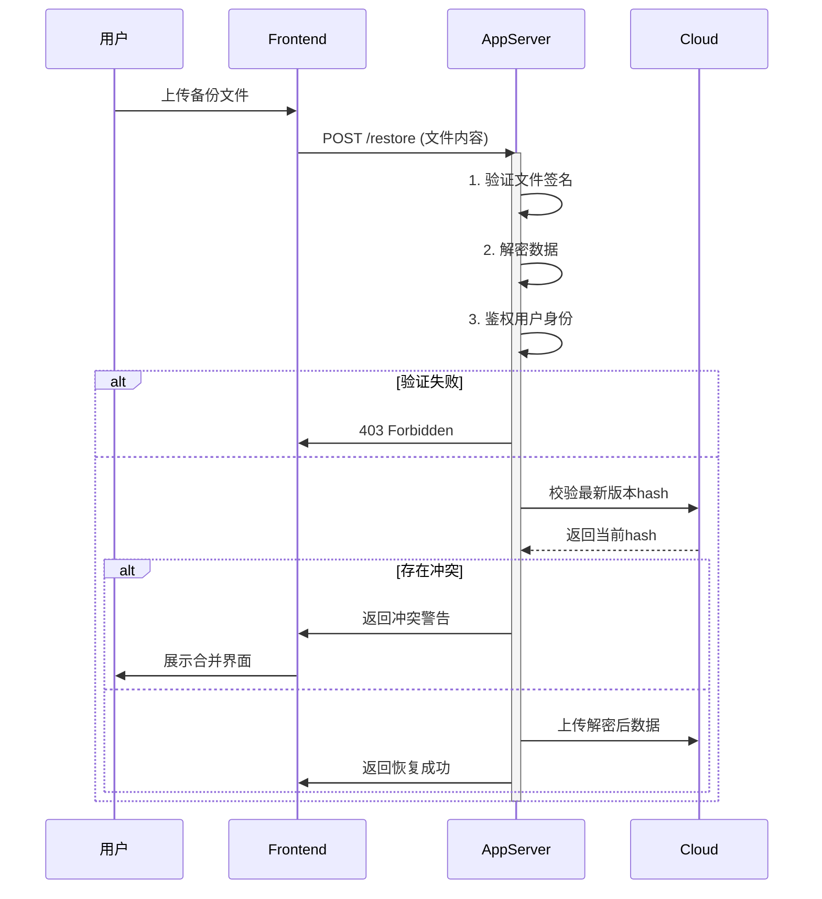

```mermaid
sequenceDiagram
    participant User as 用户
    participant Frontend
    participant AppServer
    participant Cloud

    User->>Frontend: 上传备份文件
    Frontend->>AppServer: POST /restore (文件内容)
    activate AppServer
    AppServer->>AppServer: 1. 验证文件签名
    AppServer->>AppServer: 2. 解密数据
    AppServer->>AppServer: 3. 鉴权用户身份
    alt 验证失败
        AppServer->>Frontend: 403 Forbidden
    else
        AppServer->>Cloud: 校验最新版本hash
        Cloud-->>AppServer: 返回当前hash
        alt 存在冲突
            AppServer->>Frontend: 返回冲突警告
            Frontend->>User: 展示合并界面
        else
            AppServer->>Cloud: 上传解密后数据
            AppServer->>Frontend: 返回恢复成功
        end
    end
    deactivate AppServer
```