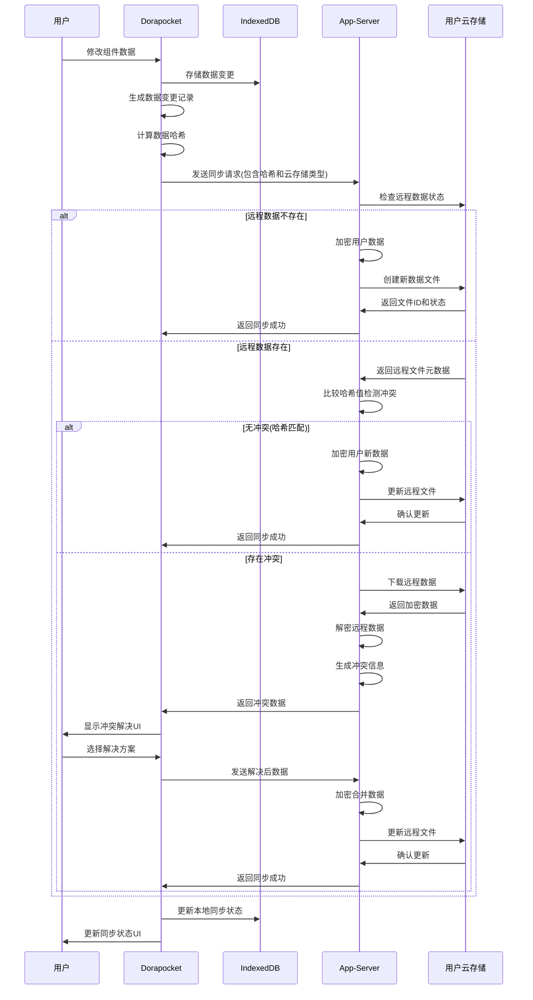

```mermaid
sequenceDiagram
    participant User as 用户
    participant Frontend as Dorapocket
    participant LocalDB as IndexedDB
    participant AppServer as App-Server
    participant UserCloud as 用户云存储
    
    User->>Frontend: 修改组件数据
    Frontend->>LocalDB: 存储数据变更
    Frontend->>Frontend: 生成数据变更记录
    Frontend->>Frontend: 计算数据哈希
    Frontend->>AppServer: 发送同步请求(包含哈希和云存储类型)
    
    AppServer->>UserCloud: 检查远程数据状态
    
    alt 远程数据不存在
        AppServer->>AppServer: 加密用户数据
        AppServer->>UserCloud: 创建新数据文件
        UserCloud->>AppServer: 返回文件ID和状态
        AppServer->>Frontend: 返回同步成功
    else 远程数据存在
        UserCloud->>AppServer: 返回远程文件元数据
        AppServer->>AppServer: 比较哈希值检测冲突
        
        alt 无冲突(哈希匹配)
            AppServer->>AppServer: 加密用户新数据
            AppServer->>UserCloud: 更新远程文件
            UserCloud->>AppServer: 确认更新
            AppServer->>Frontend: 返回同步成功
        else 存在冲突
            AppServer->>UserCloud: 下载远程数据
            UserCloud->>AppServer: 返回加密数据
            AppServer->>AppServer: 解密远程数据
            AppServer->>AppServer: 生成冲突信息
            AppServer->>Frontend: 返回冲突数据
            Frontend->>User: 显示冲突解决UI
            User->>Frontend: 选择解决方案
            Frontend->>AppServer: 发送解决后数据
            AppServer->>AppServer: 加密合并数据
            AppServer->>UserCloud: 更新远程文件
            UserCloud->>AppServer: 确认更新
            AppServer->>Frontend: 返回同步成功
        end
    end
    
    Frontend->>LocalDB: 更新本地同步状态
    Frontend->>User: 更新同步状态UI
```