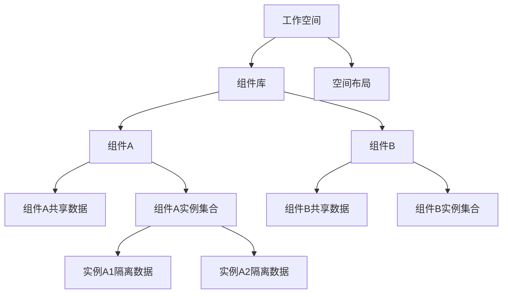

```mermaid
flowchart TD
    Workspaces[工作空间] --> Components[组件库]
    Workspaces --> WorkspaceLayout[空间布局]
    Components --> ComponentA[组件A]
    Components --> ComponentB[组件B]
    
    ComponentA --> ComponentA_Shared[组件A共享数据]
    ComponentA --> ComponentA_Instances[组件A实例集合]
    
    ComponentA_Instances --> Instance_A1[实例A1隔离数据]
    ComponentA_Instances --> Instance_A2[实例A2隔离数据]
    
    ComponentB --> ComponentB_Shared[组件B共享数据]
    ComponentB --> ComponentB_Instances[组件B实例集合]
```