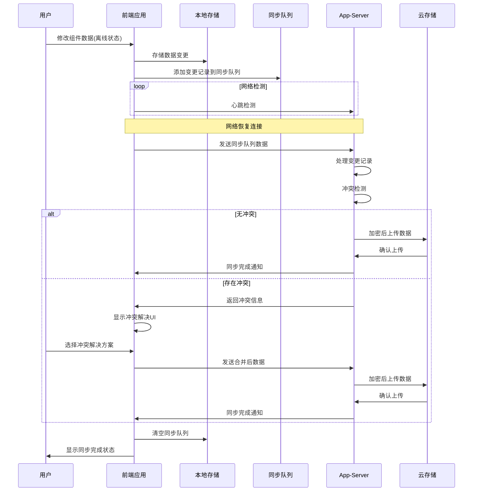

```mermaid
sequenceDiagram
    participant User as 用户
    participant Frontend as 前端应用
    participant LocalDB as 本地存储
    participant SyncQueue as 同步队列
    participant AppServer as App-Server
    participant CloudStorage as 云存储
    
    User->>Frontend: 修改组件数据(离线状态)
    Frontend->>LocalDB: 存储数据变更
    Frontend->>SyncQueue: 添加变更记录到同步队列
    
    loop 网络检测
        Frontend->>AppServer: 心跳检测
    end
    
    note over Frontend,AppServer: 网络恢复连接
    
    Frontend->>AppServer: 发送同步队列数据
    AppServer->>AppServer: 处理变更记录
    AppServer->>AppServer: 冲突检测
    
    alt 无冲突
        AppServer->>CloudStorage: 加密后上传数据
        CloudStorage->>AppServer: 确认上传
        AppServer->>Frontend: 同步完成通知
    else 存在冲突
        AppServer->>Frontend: 返回冲突信息
        Frontend->>Frontend: 显示冲突解决UI
        User->>Frontend: 选择冲突解决方案
        Frontend->>AppServer: 发送合并后数据
        AppServer->>CloudStorage: 加密后上传数据
        CloudStorage->>AppServer: 确认上传
        AppServer->>Frontend: 同步完成通知
    end
    
    Frontend->>LocalDB: 清空同步队列
    Frontend->>User: 显示同步完成状态
```