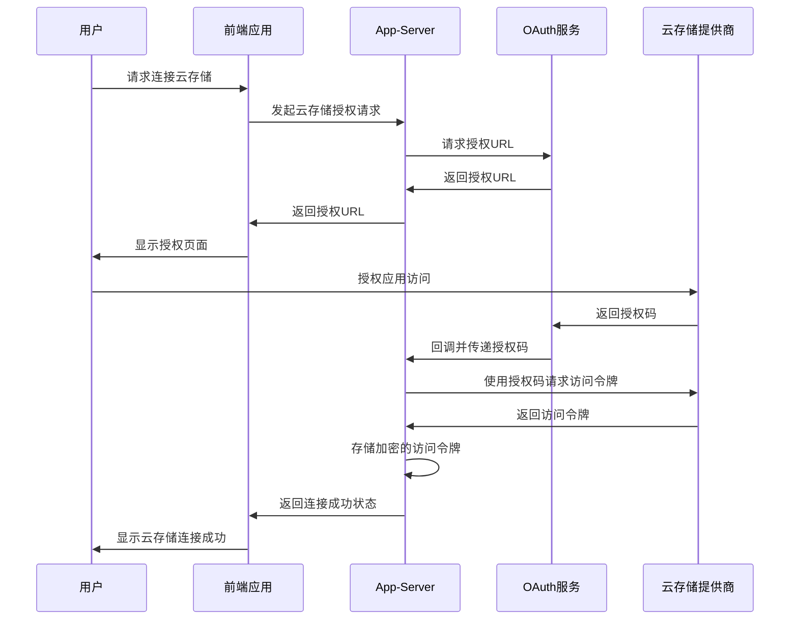

```mermaid
sequenceDiagram
    participant User as 用户
    participant Frontend as 前端应用
    participant AppServer as App-Server
    participant OAuth as OAuth服务
    participant CloudProvider as 云存储提供商
    
    User->>Frontend: 请求连接云存储
    Frontend->>AppServer: 发起云存储授权请求
    AppServer->>OAuth: 请求授权URL
    OAuth->>AppServer: 返回授权URL
    AppServer->>Frontend: 返回授权URL
    Frontend->>User: 显示授权页面
    User->>CloudProvider: 授权应用访问
    CloudProvider->>OAuth: 返回授权码
    OAuth->>AppServer: 回调并传递授权码
    AppServer->>CloudProvider: 使用授权码请求访问令牌
    CloudProvider->>AppServer: 返回访问令牌
    AppServer->>AppServer: 存储加密的访问令牌
    AppServer->>Frontend: 返回连接成功状态
    Frontend->>User: 显示云存储连接成功
```