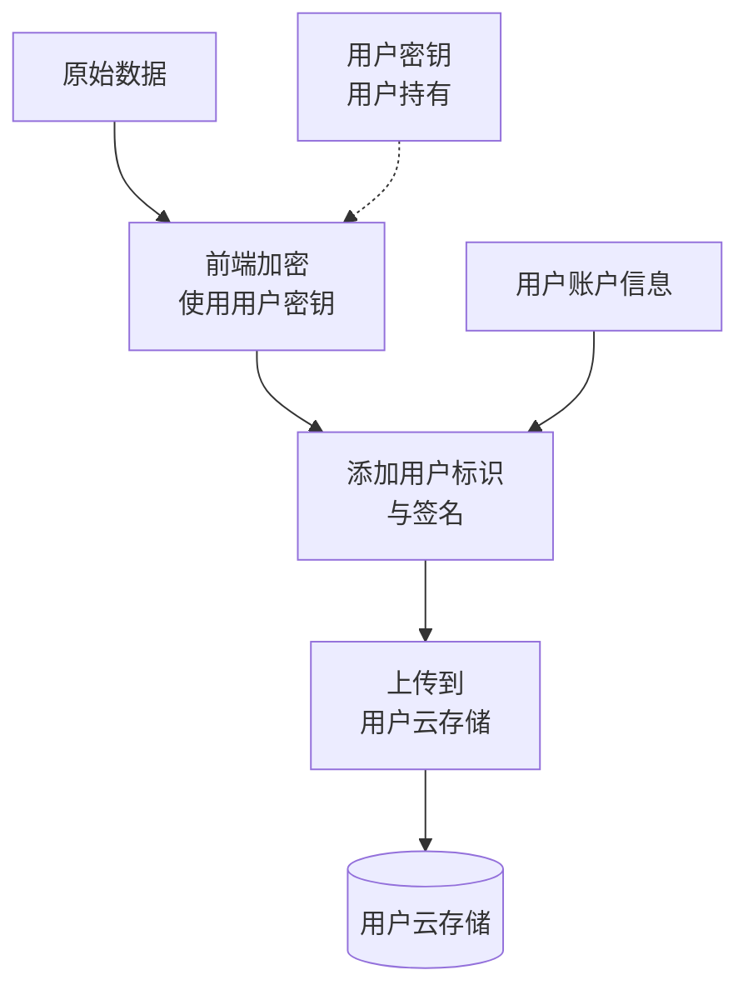

```mermaid
flowchart TD
    RawData[原始数据] --> UserEncryption[前端加密<br>使用用户密钥]
    UserEncryption --> AddUserSignature[添加用户标识<br>与签名]
    
    UserKey[用户密钥<br>用户持有] -.-> UserEncryption
    UserID[用户账户信息] --> AddUserSignature
    
    AddUserSignature --> UploadToCloud[上传到<br>用户云存储]
    UploadToCloud --> CloudStorage[(用户云存储)]
```