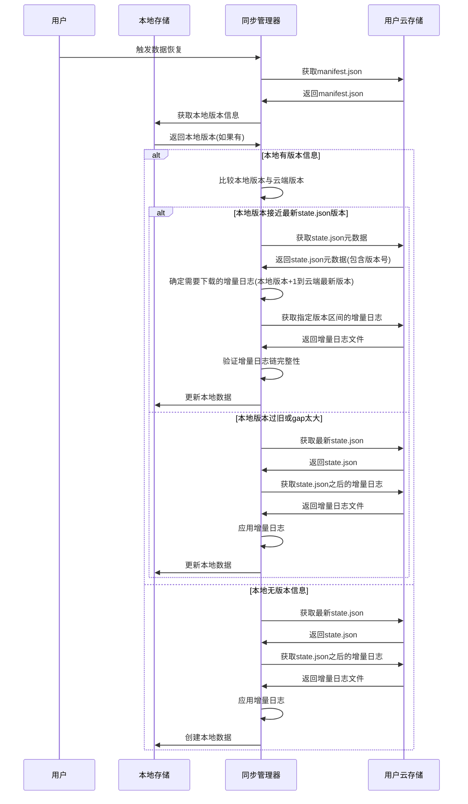

```mermaid
sequenceDiagram
    participant User as 用户
    participant LocalDB as 本地存储
    participant SyncM as 同步管理器
    participant UserCloud as 用户云存储
    
    User->>SyncM: 触发数据恢复
    SyncM->>UserCloud: 获取manifest.json
    UserCloud->>SyncM: 返回manifest.json
    
    SyncM->>LocalDB: 获取本地版本信息
    LocalDB->>SyncM: 返回本地版本(如果有)
    
    alt 本地有版本信息
        SyncM->>SyncM: 比较本地版本与云端版本
        
        alt 本地版本接近最新state.json版本
            SyncM->>UserCloud: 获取state.json元数据
            UserCloud->>SyncM: 返回state.json元数据(包含版本号)
            
            SyncM->>SyncM: 确定需要下载的增量日志(本地版本+1到云端最新版本)
            SyncM->>UserCloud: 获取指定版本区间的增量日志
            UserCloud->>SyncM: 返回增量日志文件
            
            SyncM->>SyncM: 验证增量日志链完整性
            SyncM->>LocalDB: 更新本地数据
        else 本地版本过旧或gap太大
            SyncM->>UserCloud: 获取最新state.json
            UserCloud->>SyncM: 返回state.json
            
            SyncM->>UserCloud: 获取state.json之后的增量日志
            UserCloud->>SyncM: 返回增量日志文件
            
            SyncM->>SyncM: 应用增量日志
            SyncM->>LocalDB: 更新本地数据
        end
    else 本地无版本信息
        SyncM->>UserCloud: 获取最新state.json
        UserCloud->>SyncM: 返回state.json
        
        SyncM->>UserCloud: 获取state.json之后的增量日志
        UserCloud->>SyncM: 返回增量日志文件
        
        SyncM->>SyncM: 应用增量日志
        SyncM->>LocalDB: 创建本地数据
    end
```