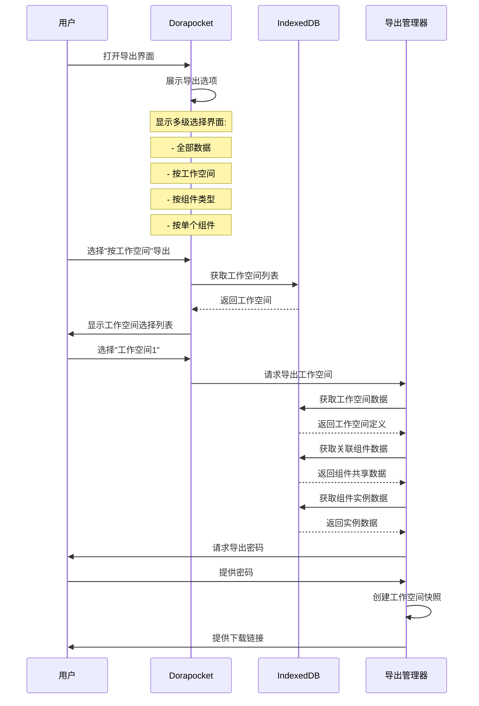

```mermaid
sequenceDiagram
    participant User as 用户
    participant App as Dorapocket
    participant LocalDB as IndexedDB
    participant ExportManager as 导出管理器
    
    User->>App: 打开导出界面
    App->>App: 展示导出选项
    
    Note over App: 显示多级选择界面:
    Note over App: - 全部数据
    Note over App: - 按工作空间
    Note over App: - 按组件类型
    Note over App: - 按单个组件
    
    User->>App: 选择"按工作空间"导出
    App->>LocalDB: 获取工作空间列表
    LocalDB-->>App: 返回工作空间
    App->>User: 显示工作空间选择列表
    
    User->>App: 选择"工作空间1"
    App->>ExportManager: 请求导出工作空间
    
    ExportManager->>LocalDB: 获取工作空间数据
    LocalDB-->>ExportManager: 返回工作空间定义
    
    ExportManager->>LocalDB: 获取关联组件数据
    LocalDB-->>ExportManager: 返回组件共享数据
    
    ExportManager->>LocalDB: 获取组件实例数据
    LocalDB-->>ExportManager: 返回实例数据
    
    ExportManager->>User: 请求导出密码
    User->>ExportManager: 提供密码
    
    ExportManager->>ExportManager: 创建工作空间快照
    ExportManager->>User: 提供下载链接
```