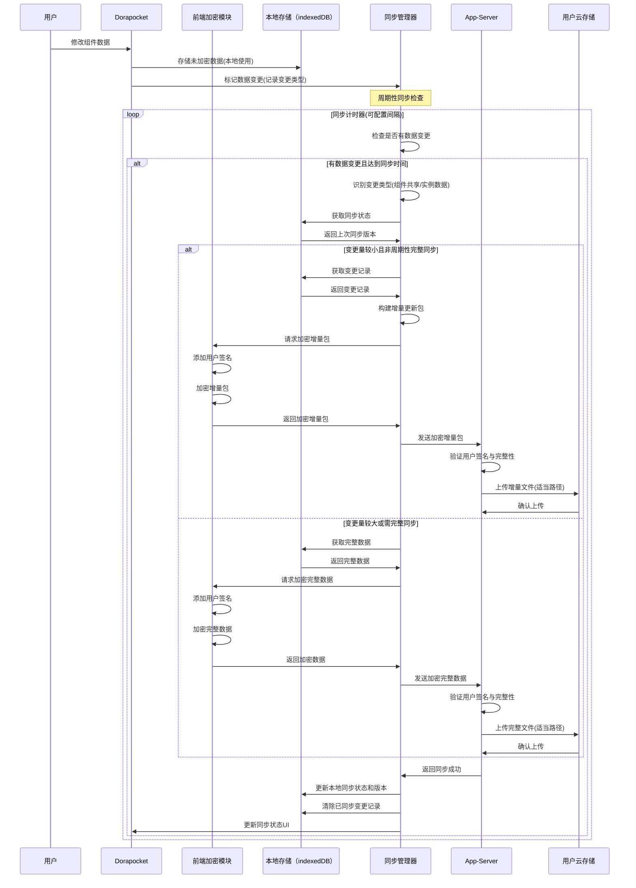

```mermaid

sequenceDiagram
    participant User as 用户
    participant Frontend as Dorapocket
    participant CryptoM as 前端加密模块
    participant LocalDB as 本地存储（indexedDB）
    participant SyncM as 同步管理器
    participant AppServer as App-Server
    participant UserCloud as 用户云存储
    
    User->>Frontend: 修改组件数据
    Frontend->>LocalDB: 存储未加密数据(本地使用)
    Frontend->>SyncM: 标记数据变更(记录变更类型)
    
    note over SyncM: 周期性同步检查
    
    loop 同步计时器(可配置间隔)
        SyncM->>SyncM: 检查是否有数据变更
        
        alt 有数据变更且达到同步时间
            SyncM->>SyncM: 识别变更类型(组件共享/实例数据)
            SyncM->>LocalDB: 获取同步状态
            LocalDB->>SyncM: 返回上次同步版本
            
            alt 变更量较小且非周期性完整同步
                SyncM->>LocalDB: 获取变更记录
                LocalDB->>SyncM: 返回变更记录
                SyncM->>SyncM: 构建增量更新包
                SyncM->>CryptoM: 请求加密增量包
                CryptoM->>CryptoM: 添加用户签名
                CryptoM->>CryptoM: 加密增量包
                CryptoM->>SyncM: 返回加密增量包
                SyncM->>AppServer: 发送加密增量包
                AppServer->>AppServer: 验证用户签名与完整性
                AppServer->>UserCloud: 上传增量文件(适当路径)
                UserCloud->>AppServer: 确认上传
            else 变更量较大或需完整同步
                SyncM->>LocalDB: 获取完整数据
                LocalDB->>SyncM: 返回完整数据
                SyncM->>CryptoM: 请求加密完整数据
                CryptoM->>CryptoM: 添加用户签名
                CryptoM->>CryptoM: 加密完整数据
                CryptoM->>SyncM: 返回加密数据
                SyncM->>AppServer: 发送加密完整数据
                AppServer->>AppServer: 验证用户签名与完整性
                AppServer->>UserCloud: 上传完整文件(适当路径)
                UserCloud->>AppServer: 确认上传
            end
            
            AppServer->>SyncM: 返回同步成功
            SyncM->>LocalDB: 更新本地同步状态和版本
            SyncM->>LocalDB: 清除已同步变更记录
            SyncM->>Frontend: 更新同步状态UI
        end
    end

```