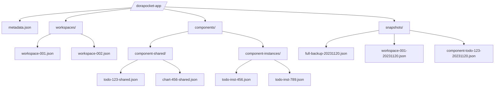

```mermaid
flowchart TD
    Root[/dorapocket-app/] --> Metadata[metadata.json]
    Root --> Workspaces[workspaces/]
    Root --> Components[components/]
    Root --> Snapshots[snapshots/]
    
    Workspaces --> WS1[workspace-001.json]
    Workspaces --> WS2[workspace-002.json]
    
    Components --> SharedData[component-shared/]
    Components --> Instances[component-instances/]
    
    SharedData --> Comp1[todo-123-shared.json]
    SharedData --> Comp2[chart-456-shared.json]
    
    Instances --> Inst1[todo-inst-456.json]
    Instances --> Inst2[todo-inst-789.json]
    
    Snapshots --> FullBackup[full-backup-20231120.json]
    Snapshots --> WSBackup[workspace-001-20231120.json]
    Snapshots --> CompBackup[component-todo-123-20231120.json]
```