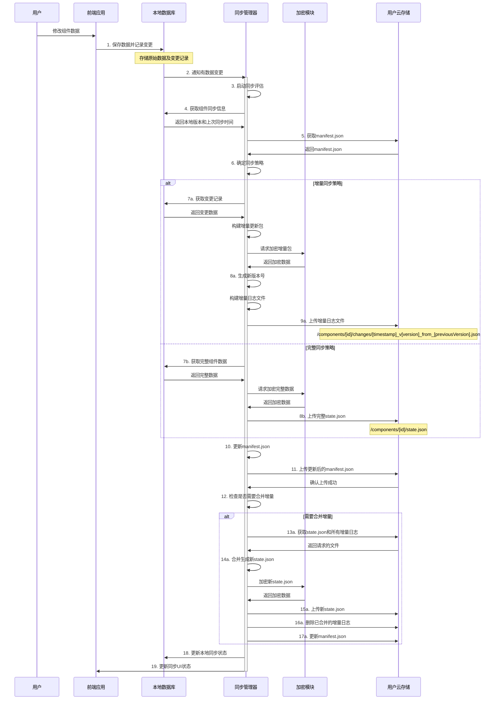

```mermaid
sequenceDiagram
    participant User as 用户
    participant Frontend as 前端应用
    participant LocalDB as 本地数据库
    participant SyncM as 同步管理器
    participant CryptoM as 加密模块
    participant UserCloud as 用户云存储
    
    User->>Frontend: 修改组件数据
    Frontend->>LocalDB: 1. 保存数据并记录变更
    Note over LocalDB: 存储原始数据及变更记录
    LocalDB->>SyncM: 2. 通知有数据变更
    
    activate SyncM
    SyncM->>SyncM: 3. 启动同步评估
    
    SyncM->>LocalDB: 4. 获取组件同步信息
    LocalDB->>SyncM: 返回本地版本和上次同步时间
    
    SyncM->>UserCloud: 5. 获取manifest.json
    UserCloud->>SyncM: 返回manifest.json
    
    SyncM->>SyncM: 6. 确定同步策略
    
    alt 增量同步策略
        SyncM->>LocalDB: 7a. 获取变更记录
        LocalDB->>SyncM: 返回变更数据
        SyncM->>SyncM: 构建增量更新包
        SyncM->>CryptoM: 请求加密增量包
        CryptoM->>SyncM: 返回加密数据
        
        SyncM->>SyncM: 8a. 生成新版本号
        SyncM->>SyncM: 构建增量日志文件
        
        SyncM->>UserCloud: 9a. 上传增量日志文件
        Note over UserCloud: /components/[id]/changes/[timestamp]_v[version]_from_[previousVersion].json
        
    else 完整同步策略
        SyncM->>LocalDB: 7b. 获取完整组件数据
        LocalDB->>SyncM: 返回完整数据
        SyncM->>CryptoM: 请求加密完整数据
        CryptoM->>SyncM: 返回加密数据
        
        SyncM->>UserCloud: 8b. 上传完整state.json
        Note over UserCloud: /components/[id]/state.json
    end
    
    SyncM->>SyncM: 10. 更新manifest.json
    SyncM->>UserCloud: 11. 上传更新后的manifest.json
    UserCloud->>SyncM: 确认上传成功
    
    SyncM->>SyncM: 12. 检查是否需要合并增量
    
    alt 需要合并增量
        SyncM->>UserCloud: 13a. 获取state.json和所有增量日志
        UserCloud->>SyncM: 返回请求的文件
        
        SyncM->>SyncM: 14a. 合并生成新state.json
        SyncM->>CryptoM: 加密新state.json
        CryptoM->>SyncM: 返回加密数据
        
        SyncM->>UserCloud: 15a. 上传新state.json
        SyncM->>UserCloud: 16a. 删除已合并的增量日志
        SyncM->>UserCloud: 17a. 更新manifest.json
    end
    
    SyncM->>LocalDB: 18. 更新本地同步状态
    SyncM->>Frontend: 19. 更新同步UI状态
    deactivate SyncM
```