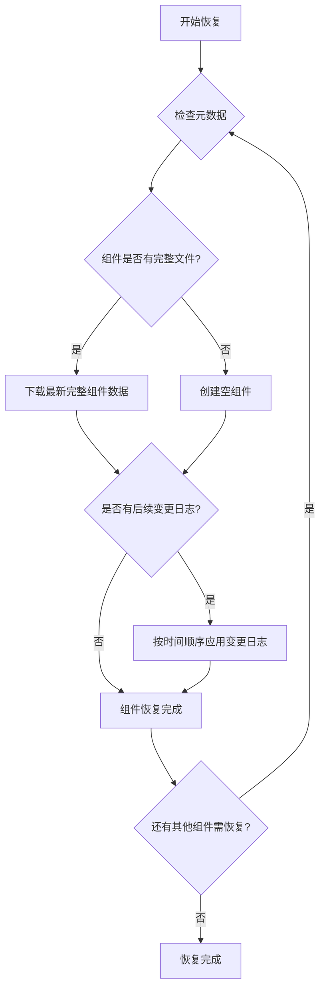

```mermaid
flowchart TD
    A[开始恢复] --> B{检查元数据}
    B --> C{组件是否有完整文件?}
    
    C -->|是| D[下载最新完整组件数据]
    C -->|否| E[创建空组件]
    
    D --> F{是否有后续变更日志?}
    E --> F
    
    F -->|是| G[按时间顺序应用变更日志]
    F -->|否| H[组件恢复完成]
    
    G --> H
    
    H --> I{还有其他组件需恢复?}
    I -->|是| B
    I -->|否| J[恢复完成]
```