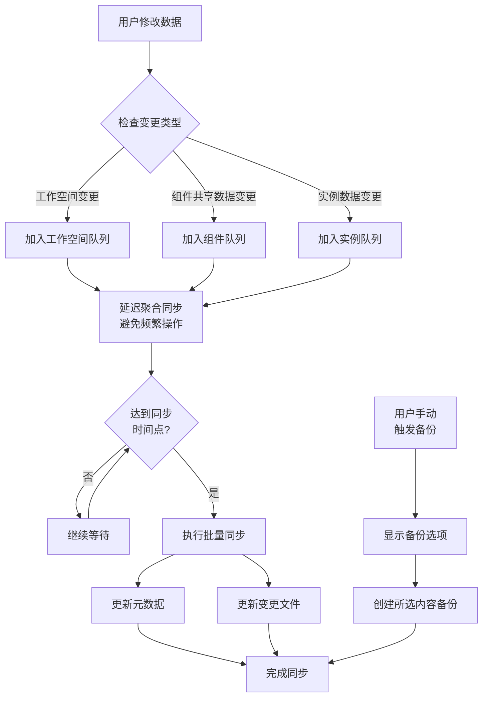

```mermaid
flowchart TD
    UserAction[用户修改数据] --> CheckChanges{检查变更类型}
    CheckChanges -->|工作空间变更| QueueWorkspace[加入工作空间队列]
    CheckChanges -->|组件共享数据变更| QueueComponent[加入组件队列]
    CheckChanges -->|实例数据变更| QueueInstance[加入实例队列]
    
    QueueWorkspace --> DelaySync[延迟聚合同步<br>避免频繁操作]
    QueueComponent --> DelaySync
    QueueInstance --> DelaySync
    
    DelaySync --> TimeCheck{达到同步<br>时间点?}
    TimeCheck -->|否| Wait[继续等待]
    TimeCheck -->|是| ExecuteSync[执行批量同步]
    Wait --> TimeCheck
    
    ExecuteSync --> UpdateMetadata[更新元数据]
    ExecuteSync --> UpdateChanged[更新变更文件]
    
    UpdateMetadata --> Complete[完成同步]
    UpdateChanged --> Complete
    
    UserTrigger[用户手动<br>触发备份] --> BackupDialog[显示备份选项]
    BackupDialog --> CreateBackup[创建所选内容备份]
    CreateBackup --> Complete
```