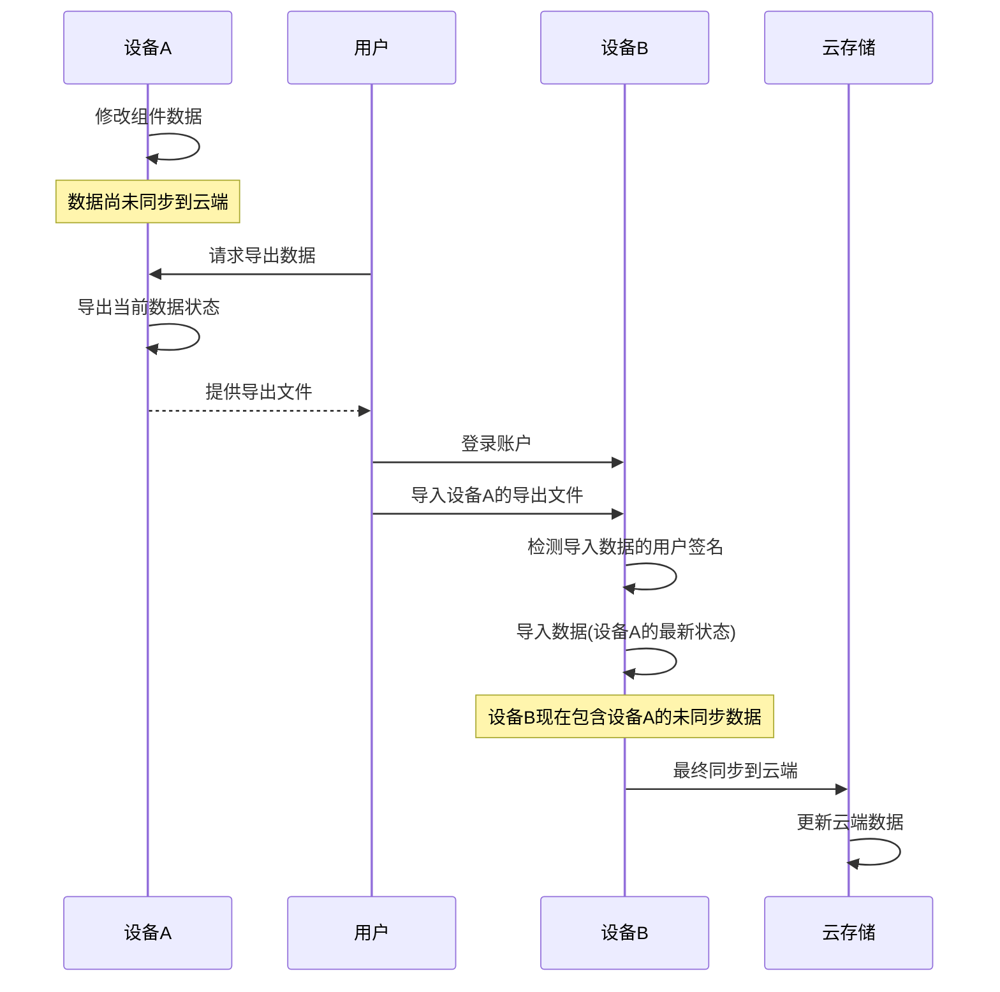

```mermaid
sequenceDiagram
    participant DeviceA as 设备A
    participant User as 用户
    participant DeviceB as 设备B
    participant Cloud as 云存储
    
    DeviceA->>DeviceA: 修改组件数据
    note over DeviceA: 数据尚未同步到云端
    
    User->>DeviceA: 请求导出数据
    DeviceA->>DeviceA: 导出当前数据状态
    DeviceA-->>User: 提供导出文件
    
    User->>DeviceB: 登录账户
    User->>DeviceB: 导入设备A的导出文件
    
    DeviceB->>DeviceB: 检测导入数据的用户签名
    DeviceB->>DeviceB: 导入数据(设备A的最新状态)
    
    note over DeviceB: 设备B现在包含设备A的未同步数据
    
    DeviceB->>Cloud: 最终同步到云端
    Cloud->>Cloud: 更新云端数据
```