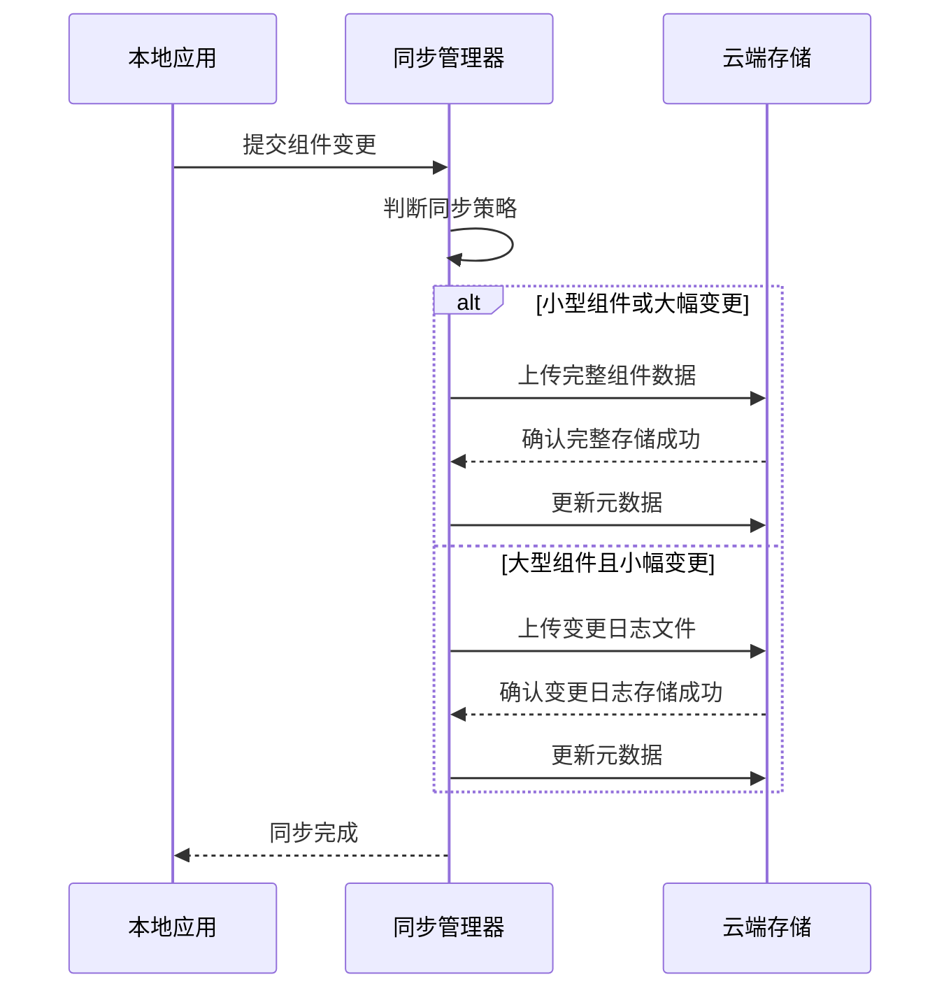

```mermaid
sequenceDiagram
    participant 本地应用
    participant 同步管理器
    participant 云端存储
    
    本地应用->>同步管理器: 提交组件变更
    同步管理器->>同步管理器: 判断同步策略
    
    alt 小型组件或大幅变更
        同步管理器->>云端存储: 上传完整组件数据
        云端存储-->>同步管理器: 确认完整存储成功
        同步管理器->>云端存储: 更新元数据
    else 大型组件且小幅变更
        同步管理器->>云端存储: 上传变更日志文件
        云端存储-->>同步管理器: 确认变更日志存储成功
        同步管理器->>云端存储: 更新元数据
    end
    
    同步管理器-->>本地应用: 同步完成
```