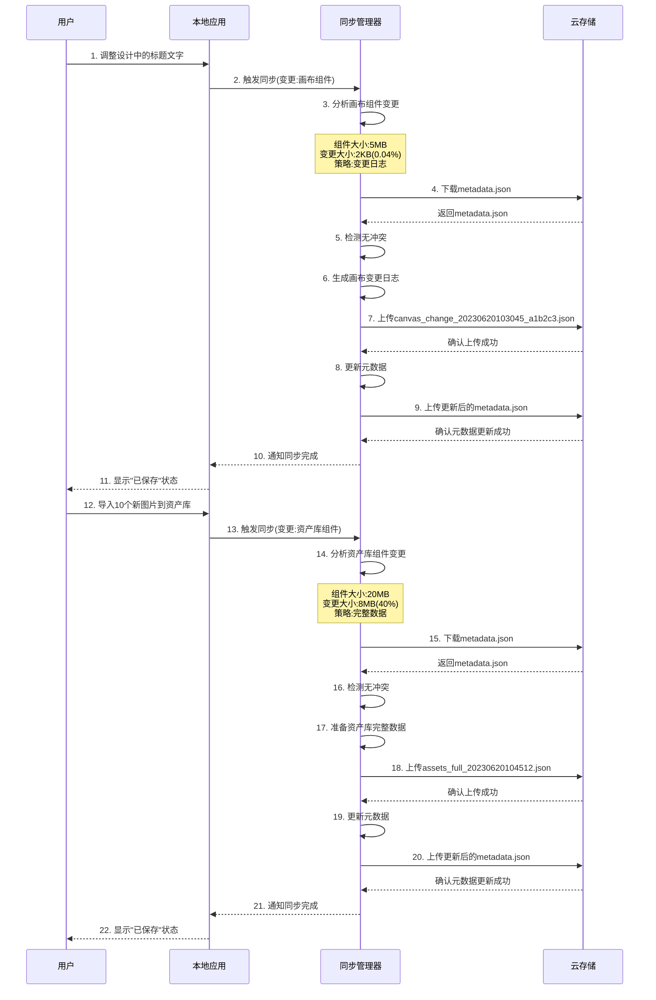

```mermaid
sequenceDiagram
    participant 用户
    participant 本地应用
    participant 同步管理器
    participant 云存储
    
    用户->>本地应用: 1. 调整设计中的标题文字
    本地应用->>同步管理器: 2. 触发同步(变更:画布组件)
    
    同步管理器->>同步管理器: 3. 分析画布组件变更
    Note over 同步管理器: 组件大小:5MB<br>变更大小:2KB(0.04%)<br>策略:变更日志
    
    同步管理器->>云存储: 4. 下载metadata.json
    云存储-->>同步管理器: 返回metadata.json
    
    同步管理器->>同步管理器: 5. 检测无冲突
    同步管理器->>同步管理器: 6. 生成画布变更日志
    
    同步管理器->>云存储: 7. 上传canvas_change_20230620103045_a1b2c3.json
    云存储-->>同步管理器: 确认上传成功
    
    同步管理器->>同步管理器: 8. 更新元数据
    同步管理器->>云存储: 9. 上传更新后的metadata.json
    云存储-->>同步管理器: 确认元数据更新成功
    
    同步管理器-->>本地应用: 10. 通知同步完成
    本地应用-->>用户: 11. 显示"已保存"状态
    
    用户->>本地应用: 12. 导入10个新图片到资产库
    本地应用->>同步管理器: 13. 触发同步(变更:资产库组件)
    
    同步管理器->>同步管理器: 14. 分析资产库组件变更
    Note over 同步管理器: 组件大小:20MB<br>变更大小:8MB(40%)<br>策略:完整数据
    
    同步管理器->>云存储: 15. 下载metadata.json
    云存储-->>同步管理器: 返回metadata.json
    
    同步管理器->>同步管理器: 16. 检测无冲突
    同步管理器->>同步管理器: 17. 准备资产库完整数据
    
    同步管理器->>云存储: 18. 上传assets_full_20230620104512.json
    云存储-->>同步管理器: 确认上传成功
    
    同步管理器->>同步管理器: 19. 更新元数据
    同步管理器->>云存储: 20. 上传更新后的metadata.json
    云存储-->>同步管理器: 确认元数据更新成功
    
    同步管理器-->>本地应用: 21. 通知同步完成
    本地应用-->>用户: 22. 显示"已保存"状态
```