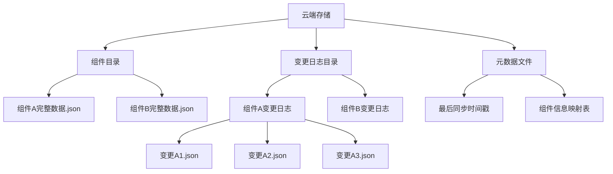

```mermaid
graph TD
    Cloud[云端存储] --> Components[组件目录]
    Cloud --> ChangeLogs[变更日志目录]
    Cloud --> Metadata[元数据文件]
    
    Components --> CompA[组件A完整数据.json]
    Components --> CompB[组件B完整数据.json]
    
    ChangeLogs --> LogA[组件A变更日志]
    ChangeLogs --> LogB[组件B变更日志]
    
    LogA --> LogA1[变更A1.json]
    LogA --> LogA2[变更A2.json]
    LogA --> LogA3[变更A3.json]
    
    Metadata --> LastSync[最后同步时间戳]
    Metadata --> ComponentInfo[组件信息映射表]
```