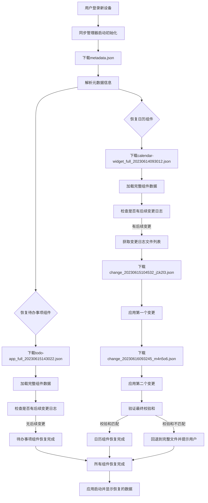

```mermaid
flowchart TD
    A[用户登录新设备] --> B[同步管理器启动初始化]
    B --> C[下载metadata.json]
    C --> D[解析元数据信息]
    
    D --> E{恢复待办事项组件}
    E --> E1[下载todo-app_full_20230615143022.json]
    E1 --> E2[加载完整组件数据]
    E2 --> E3[检查是否有后续变更日志]
    E3 -->|无后续变更| E4[待办事项组件恢复完成]
    
    D --> F{恢复日历组件}
    F --> F1[下载calendar-widget_full_20230614093012.json]
    F1 --> F2[加载完整组件数据]
    F2 --> F3[检查是否有后续变更日志]
    F3 -->|有后续变更| F4[获取变更日志文件列表]
    F4 --> F5[下载change_20230615104532_j1k2l3.json]
    F5 --> F6[应用第一个变更]
    F6 --> F7[下载change_20230616093245_m4n5o6.json]
    F7 --> F8[应用第二个变更]
    F8 --> F9[验证最终校验和]
    F9 -->|校验和匹配| F10[日历组件恢复完成]
    F9 -->|校验和不匹配| F11[回退到完整文件并提示用户]
    
    E4 --> G[所有组件恢复完成]
    F10 --> G
    F11 --> G
    
    G --> H[应用启动并显示恢复的数据]
```