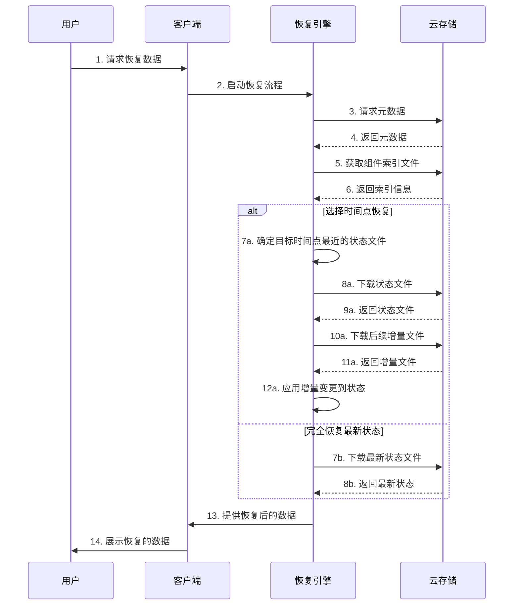

```mermaid
sequenceDiagram
    participant 用户
    participant 客户端
    participant 恢复引擎
    participant 云存储
    
    用户->>客户端: 1. 请求恢复数据
    客户端->>恢复引擎: 2. 启动恢复流程
    恢复引擎->>云存储: 3. 请求元数据
    云存储-->>恢复引擎: 4. 返回元数据
    恢复引擎->>云存储: 5. 获取组件索引文件
    云存储-->>恢复引擎: 6. 返回索引信息
    
    alt 选择时间点恢复
        恢复引擎->>恢复引擎: 7a. 确定目标时间点最近的状态文件
        恢复引擎->>云存储: 8a. 下载状态文件
        云存储-->>恢复引擎: 9a. 返回状态文件
        恢复引擎->>云存储: 10a. 下载后续增量文件
        云存储-->>恢复引擎: 11a. 返回增量文件
        恢复引擎->>恢复引擎: 12a. 应用增量变更到状态
    else 完全恢复最新状态
        恢复引擎->>云存储: 7b. 下载最新状态文件
        云存储-->>恢复引擎: 8b. 返回最新状态
    end
    
    恢复引擎->>客户端: 13. 提供恢复后的数据
    客户端->>用户: 14. 展示恢复的数据
```