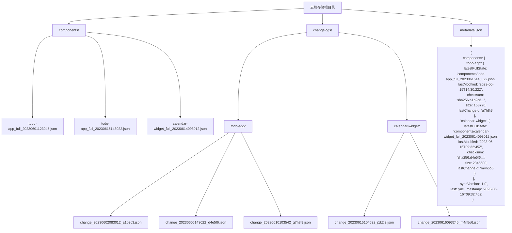

```mermaid
graph TD
    Cloud[云端存储根目录] --> ComponentsDir[components/]
    Cloud --> ChangeLogsDir[changelogs/]
    Cloud --> MetadataFile[metadata.json]
    
    ComponentsDir --> TodoAppFull[todo-app_full_20230601123045.json]
    ComponentsDir --> TodoAppFullNew[todo-app_full_20230615143022.json]
    ComponentsDir --> CalendarFull[calendar-widget_full_20230614093012.json]
    
    ChangeLogsDir --> TodoChangeLogs[todo-app/]
    ChangeLogsDir --> CalendarChangeLogs[calendar-widget/]
    
    TodoChangeLogs --> TodoChange1[change_20230602083012_a1b2c3.json]
    TodoChangeLogs --> TodoChange2[change_20230605143022_d4e5f6.json]
    TodoChangeLogs --> TodoChange3[change_20230610103542_g7h8i9.json]
    
    CalendarChangeLogs --> CalChange1[change_20230615104532_j1k2l3.json]
    CalendarChangeLogs --> CalChange2[change_20230616093245_m4n5o6.json]
    
    MetadataFile --> MetadataContent["
    {
      components: {
        'todo-app': {
          latestFullState: 'components/todo-app_full_20230615143022.json',
          lastModified: '2023-06-15T14:30:22Z',
          checksum: 'sha256:a1b2c3...',
          size: 158720,
          lastChangeId: 'g7h8i9'
        },
        'calendar-widget': {
          latestFullState: 'components/calendar-widget_full_20230614093012.json',
          lastModified: '2023-06-16T09:32:45Z',
          checksum: 'sha256:d4e5f6...',
          size: 2345600,
          lastChangeId: 'm4n5o6'
        }
      },
      syncVersion: '1.0',
      lastSyncTimestamp: '2023-06-16T09:32:45Z'
    }
    "]
```