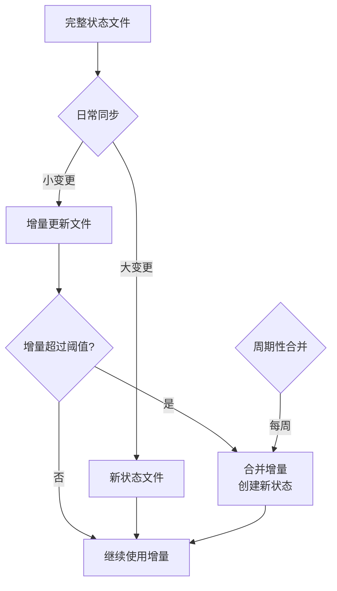

```mermaid
flowchart TD
    State[完整状态文件] --> Daily{日常同步}
    Daily -->|小变更| Delta[增量更新文件]
    Daily -->|大变更| NewState[新状态文件]
    Delta --> Threshold{增量超过阈值?}
    Threshold -->|是| Consolidate[合并增量<br>创建新状态]
    Threshold -->|否| Continue[继续使用增量]
    
    Periodic{周期性合并} -->|每周| Consolidate
    
    NewState --> Continue
    Consolidate --> Continue
```