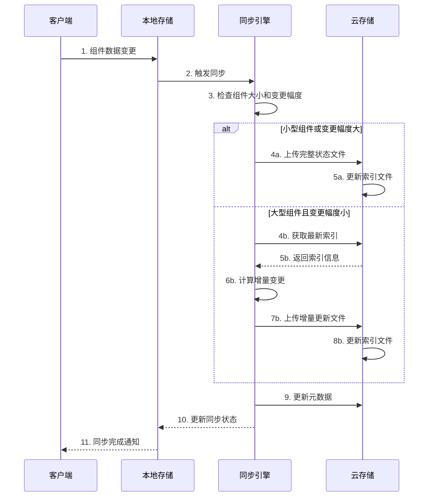

```mermaid
sequenceDiagram
    participant 客户端
    participant 本地存储
    participant 同步引擎
    participant 云存储
    
    客户端->>本地存储: 1. 组件数据变更
    本地存储->>同步引擎: 2. 触发同步
    同步引擎->>同步引擎: 3. 检查组件大小和变更幅度
    
    alt 小型组件或变更幅度大
        同步引擎->>云存储: 4a. 上传完整状态文件
        云存储->>云存储: 5a. 更新索引文件
    else 大型组件且变更幅度小
        同步引擎->>云存储: 4b. 获取最新索引
        云存储-->>同步引擎: 5b. 返回索引信息
        同步引擎->>同步引擎: 6b. 计算增量变更
        同步引擎->>云存储: 7b. 上传增量更新文件
        云存储->>云存储: 8b. 更新索引文件
    end
    
    同步引擎->>云存储: 9. 更新元数据
    同步引擎-->>本地存储: 10. 更新同步状态
    本地存储-->>客户端: 11. 同步完成通知
```