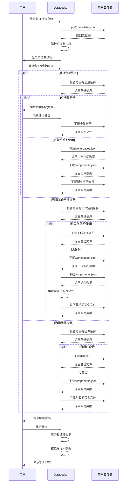

```mermaid
sequenceDiagram
    participant User as 用户
    participant App as Dorapocket
    participant Cloud as 用户云存储
    
    User->>App: 登录并连接云存储
    App->>Cloud: 获取metadata.json
    Cloud-->>App: 返回元数据
    
    App->>App: 解析可恢复内容
    App->>User: 显示可恢复选项
    
    User->>App: 选择恢复级别和内容
    
    alt 选择全部恢复
        App->>Cloud: 检查是否有全量备份
        Cloud-->>App: 返回备份信息
        
        alt 有全量备份
            App->>User: 推荐使用备份(更快)
            User->>App: 确认使用备份
            
            App->>Cloud: 下载全量备份
            Cloud-->>App: 返回备份文件
        else 无备份或不使用
            App->>Cloud: 下载workspaces.json
            Cloud-->>App: 返回工作空间数据
            
            App->>Cloud: 下载components.json
            Cloud-->>App: 返回组件数据
            
            App->>Cloud: 下载所有实例文件
            Cloud-->>App: 返回实例数据
        end
        
    else 选择工作空间恢复
        App->>Cloud: 检查是否有工作空间备份
        Cloud-->>App: 返回备份信息
        
        alt 有工作空间备份
            App->>Cloud: 下载工作空间备份
            Cloud-->>App: 返回备份文件
        else 无备份
            App->>Cloud: 下载workspaces.json
            Cloud-->>App: 返回工作空间数据
            
            App->>Cloud: 下载components.json
            Cloud-->>App: 返回组件数据
            
            App->>App: 确定需要的实例文件
            App->>Cloud: 仅下载相关实例文件
            Cloud-->>App: 返回实例数据
        end
        
    else 选择组件恢复
        App->>Cloud: 检查是否有组件备份
        Cloud-->>App: 返回备份信息
        
        alt 有组件备份
            App->>Cloud: 下载组件备份
            Cloud-->>App: 返回备份文件
        else 无备份
            App->>Cloud: 下载components.json
            Cloud-->>App: 返回组件数据
            
            App->>Cloud: 下载对应的实例文件
            Cloud-->>App: 返回实例数据
        end
    end
    
    App->>User: 请求解密密码
    User->>App: 提供密码
    
    App->>App: 解密和处理数据
    App->>App: 按选择导入数据
    App->>User: 显示恢复完成
```