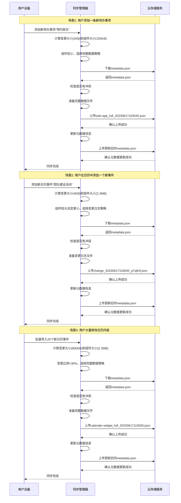

```mermaid
sequenceDiagram
    participant 用户设备
    participant 同步管理器
    participant 云存储服务
    
    Note over 用户设备,云存储服务: 场景1: 用户添加一条新待办事项
    
    用户设备->>同步管理器: 添加新待办事项"预约医生"
    同步管理器->>同步管理器: 计算变更大小(2KB)和组件大小(155KB)
    同步管理器->>同步管理器: 组件较小，选择完整数据策略
    同步管理器->>云存储服务: 下载metadata.json
    云存储服务-->>同步管理器: 返回metadata.json
    同步管理器->>同步管理器: 检查是否有冲突
    同步管理器->>同步管理器: 准备完整数据文件
    同步管理器->>云存储服务: 上传todo-app_full_20230617103045.json
    云存储服务-->>同步管理器: 确认上传成功
    同步管理器->>同步管理器: 更新元数据信息
    同步管理器->>云存储服务: 上传更新后的metadata.json
    云存储服务-->>同步管理器: 确认元数据更新成功
    同步管理器-->>用户设备: 同步完成
    
    Note over 用户设备,云存储服务: 场景2: 用户在日历中添加一个新事件
    
    用户设备->>同步管理器: 添加新日历事件"团队建设活动"
    同步管理器->>同步管理器: 计算变更大小(4KB)和组件大小(2.3MB)
    同步管理器->>同步管理器: 组件较大且变更小，选择变更日志策略
    同步管理器->>云存储服务: 下载metadata.json
    云存储服务-->>同步管理器: 返回metadata.json
    同步管理器->>同步管理器: 检查是否有冲突
    同步管理器->>同步管理器: 准备变更日志文件
    同步管理器->>云存储服务: 上传change_20230617103045_p7q8r9.json
    云存储服务-->>同步管理器: 确认上传成功
    同步管理器->>同步管理器: 更新元数据信息
    同步管理器->>云存储服务: 上传更新后的metadata.json
    云存储服务-->>同步管理器: 确认元数据更新成功
    同步管理器-->>用户设备: 同步完成
    
    Note over 用户设备,云存储服务: 场景3: 用户大量修改日历内容
    
    用户设备->>同步管理器: 批量导入20个新日历事件
    同步管理器->>同步管理器: 计算变更大小(800KB)和组件大小(2.3MB)
    同步管理器->>同步管理器: 变更比例>30%，选择完整数据策略
    同步管理器->>云存储服务: 下载metadata.json
    云存储服务-->>同步管理器: 返回metadata.json
    同步管理器->>同步管理器: 检查是否有冲突
    同步管理器->>同步管理器: 准备完整数据文件
    同步管理器->>云存储服务: 上传calendar-widget_full_20230617110030.json
    云存储服务-->>同步管理器: 确认上传成功
    同步管理器->>同步管理器: 更新元数据信息
    同步管理器->>云存储服务: 上传更新后的metadata.json
    云存储服务-->>同步管理器: 确认元数据更新成功
    同步管理器-->>用户设备: 同步完成
```