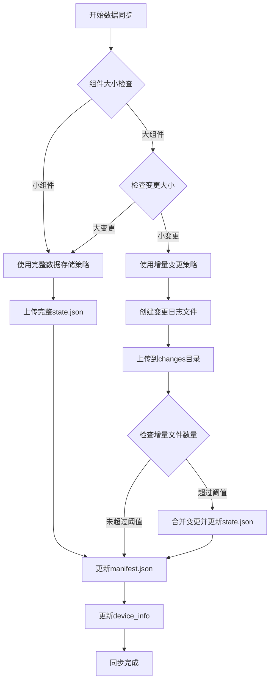

```mermaid
flowchart TD
    A[开始数据同步] --> B{组件大小检查}
    B -->|大组件| C{检查变更大小}
    B -->|小组件| D[使用完整数据存储策略]
    
    C -->|小变更| E[使用增量变更策略]
    C -->|大变更| D
    
    D --> F[上传完整state.json]
    F --> G[更新manifest.json]
    G --> H[更新device_info]
    
    E --> I[创建变更日志文件]
    I --> J[上传到changes目录]
    J --> K{检查增量文件数量}
    K -->|超过阈值| L[合并变更并更新state.json]
    K -->|未超过阈值| G
    
    L --> G
    
    H --> M[同步完成]
```