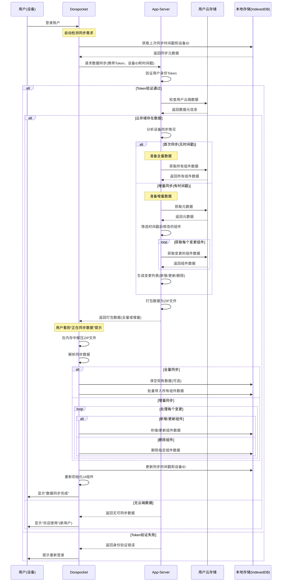

```mermaid
sequenceDiagram
    participant User as 用户(设备)
    participant App as Dorapocket
    participant AppServer as App-Server
    participant UserCloud as 用户云存储
    participant LocalDB as 本地存储(IndexedDB)
    
    User->>App: 登录账户
    Note over App: 自动检测同步需求
    
    App->>LocalDB: 获取上次同步时间戳和设备ID
    LocalDB-->>App: 返回同步元数据
    
    App->>AppServer: 请求数据同步(携带Token、设备ID和时间戳)
    AppServer->>AppServer: 验证用户身份Token
    
    alt Token验证通过
        AppServer->>UserCloud: 检查用户云端数据
        UserCloud-->>AppServer: 返回数据元信息
        
        alt 云存储存在数据
            AppServer->>AppServer: 分析设备同步情况
            
            alt 首次同步(无时间戳)
                Note over AppServer: 准备全量数据
                AppServer->>UserCloud: 获取所有组件数据
                UserCloud-->>AppServer: 返回所有组件数据
                
            else 增量同步(有时间戳)
                Note over AppServer: 准备增量数据
                AppServer->>UserCloud: 获取元数据
                UserCloud-->>AppServer: 返回元数据
                
                AppServer->>AppServer: 筛选时间戳后修改的组件
                
                loop 获取每个变更组件
                    AppServer->>UserCloud: 获取变更的组件数据
                    UserCloud-->>AppServer: 返回组件数据
                end
                
                AppServer->>AppServer: 生成变更列表(新增/更新/删除)
            end
            
            AppServer->>AppServer: 打包数据为ZIP文件
            AppServer-->>App: 返回打包数据(全量或增量)
            
            Note over App: 用户看到"正在同步数据"提示
            
            App->>App: 在内存中解压ZIP文件
            App->>App: 解析同步数据
            
            alt 全量同步
                App->>LocalDB: 清空现有数据(可选)
                App->>LocalDB: 批量导入所有组件数据
            else 增量同步
                loop 处理每个变更
                    alt 新增/更新组件
                        App->>LocalDB: 存储/更新组件数据
                    else 删除组件
                        App->>LocalDB: 删除指定组件数据
                    end
                end
            end
            
            App->>LocalDB: 更新同步时间戳和设备ID
            App->>App: 重新初始化UI组件
            App->>User: 显示"数据同步完成"
            
        else 无云端数据
            AppServer-->>App: 返回无可同步数据
            App->>User: 显示"欢迎使用"(新用户)
        end
    else Token验证失败
        AppServer-->>App: 返回身份验证错误
        App->>User: 提示重新登录
    end
```