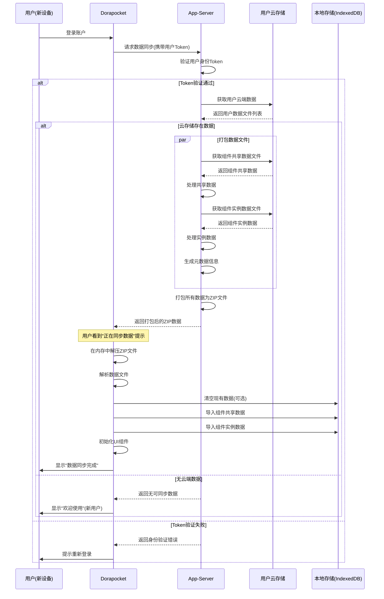

```mermaid
sequenceDiagram
    participant User as 用户(新设备)
    participant App as Dorapocket
    participant AppServer as App-Server
    participant UserCloud as 用户云存储
    participant LocalDB as 本地存储(IndexedDB)
    
    User->>App: 登录账户
    
    App->>AppServer: 请求数据同步(携带用户Token)
    AppServer->>AppServer: 验证用户身份Token
    
    alt Token验证通过
        AppServer->>UserCloud: 获取用户云端数据
        UserCloud-->>AppServer: 返回用户数据文件列表
        
        alt 云存储存在数据
            par 打包数据文件
                AppServer->>UserCloud: 获取组件共享数据文件
                UserCloud-->>AppServer: 返回组件共享数据
                AppServer->>AppServer: 处理共享数据
                
                AppServer->>UserCloud: 获取组件实例数据文件
                UserCloud-->>AppServer: 返回组件实例数据
                AppServer->>AppServer: 处理实例数据
                
                AppServer->>AppServer: 生成元数据信息
            end
            
            AppServer->>AppServer: 打包所有数据为ZIP文件
            AppServer-->>App: 返回打包后的ZIP数据
            
            Note over App: 用户看到"正在同步数据"提示
            
            App->>App: 在内存中解压ZIP文件
            App->>App: 解析数据文件
            
            App->>LocalDB: 清空现有数据(可选)
            App->>LocalDB: 导入组件共享数据
            App->>LocalDB: 导入组件实例数据
            
            App->>App: 初始化UI组件
            App->>User: 显示"数据同步完成"
        else 无云端数据
            AppServer-->>App: 返回无可同步数据
            App->>User: 显示"欢迎使用"(新用户)
        end
    else Token验证失败
        AppServer-->>App: 返回身份验证错误
        App->>User: 提示重新登录
    end
```